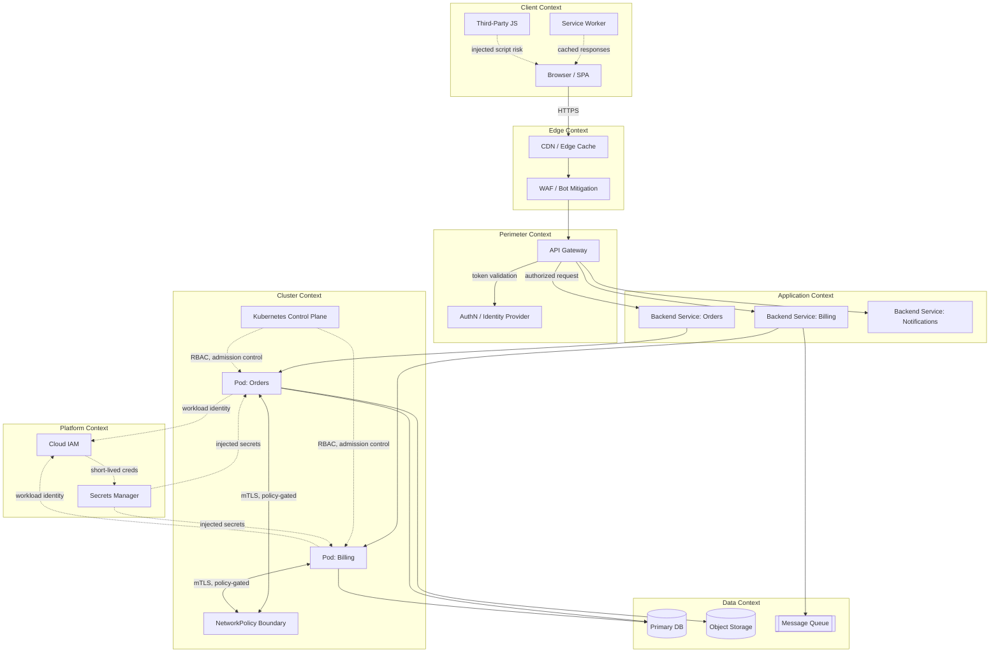
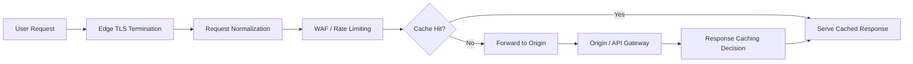
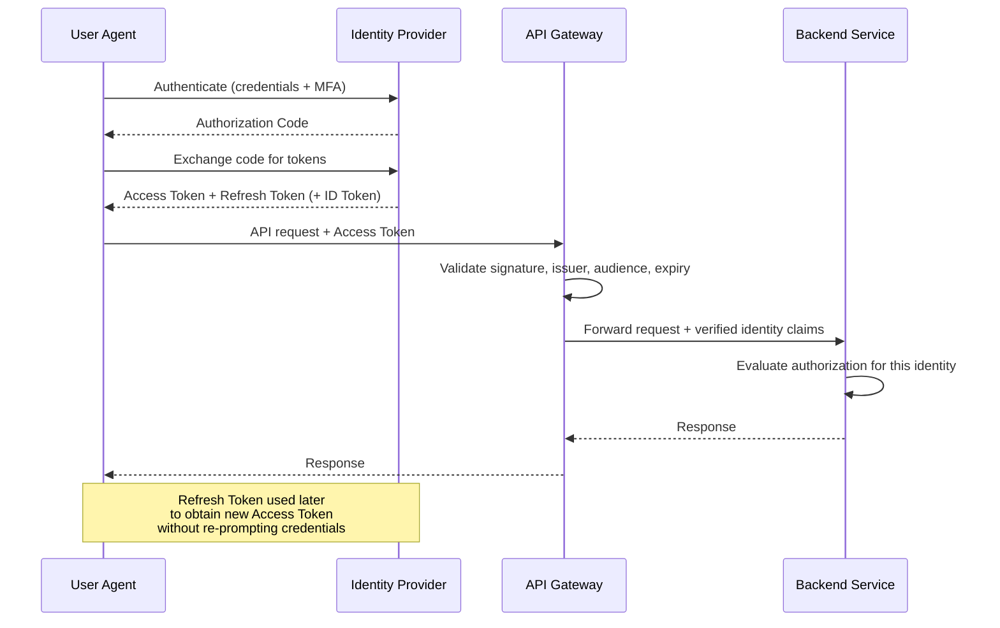
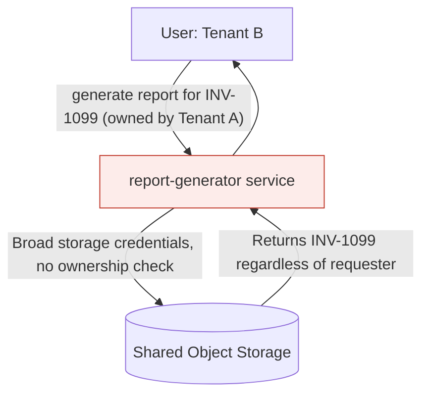
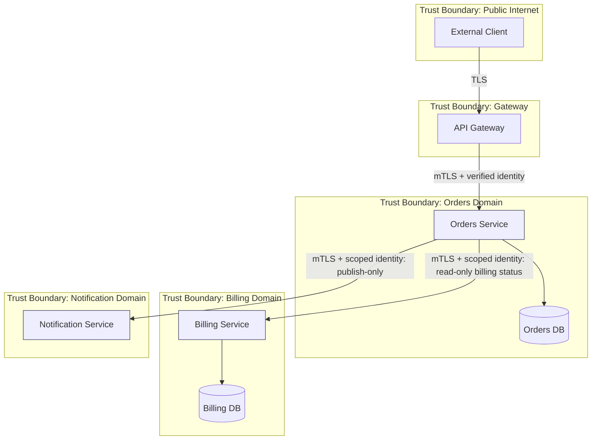
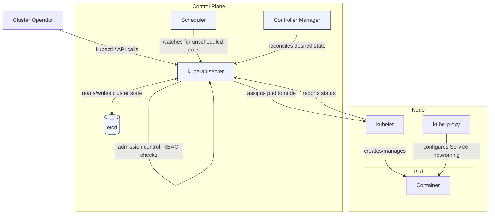
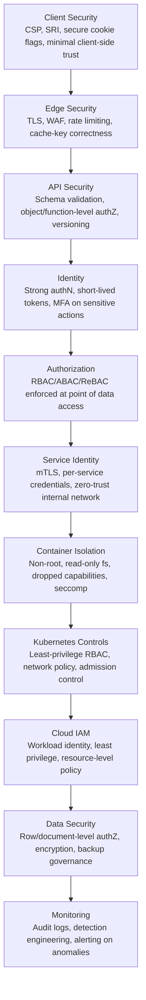

## 1. Introduction

For a long time, security education leaned on a simple mental model:

```
Browser → Server → Database
```

This model was never fully accurate, but it was close enough to reason about when applications were monolithic, deployed to a handful of servers, and talked to a single database over a trusted internal network. Today it is actively misleading.

A representative modern application — call it **Northwind Ledger**, a fictional SaaS platform used throughout this article — is not three components. It is dozens of independently deployed services, each with its own identity, its own permissions, and its own failure modes, connected by a mesh of trust decisions that are made continuously and mostly invisibly. A single user action — clicking "export invoice" — might traverse a CDN edge node, an API gateway, an authentication service, three internal microservices, a Kubernetes cluster's scheduler and network policy layer, a secrets manager, an object storage bucket, and a message queue, before a PDF ever reaches the browser.

Each hop in that chain is a **trust boundary**: a point where control passes from one security context to another, and where an assumption made by one component must be honored by the next. Security failures rarely occur because a single boundary is "hacked" in the cinematic sense. They occur because an assumption quietly breaks — a service assumed the network was trusted, a container assumed root was necessary, a `ServiceAccount` assumed broad permissions were harmless because "nothing malicious runs in this namespace."

> Modern application security is not the security of a server. It is the security of a *graph* of identities, privileges, and trust relationships.

This article treats a cloud-native application as exactly that: a graph. It walks the graph node by node, from the browser tab to the Kubernetes control plane and the cloud IAM layer underneath it, examining what each layer can and cannot be trusted to enforce, what happens when it fails, and how a security researcher — or a defender — should reason about the system as a whole rather than as a collection of isolated components.

This is a defensive and architectural piece. It does not provide exploitation instructions, credential-theft techniques, or attack chains. Its purpose is to build a mental model precise enough that you can look at *your own* architecture diagram and immediately start asking the right questions.

---

## 2. The Application as a Security Graph

Traditional security thinking treats an application as a perimeter: an inside and an outside, with a wall in between. Cloud-native architecture breaks this model because there is no single perimeter — there are dozens of small perimeters, each with different defenders, different failure modes, and different blast radii.

A more useful model is a **directed graph**, where:

- **Nodes** are components: browsers, edge nodes, services, containers, databases, queues.
- **Edges** are data flows and trust relationships: which component calls which, and with what identity.
- **Node attributes** describe privilege: what an identity can do if it is compromised.
- **Edge attributes** describe the strength of the boundary: is this call authenticated? Encrypted? Authorized per-request, or trusted by network location alone?

Reasoning about security this way turns "is this system secure?" — an unanswerable question — into a tractable one: *for every edge in this graph, what happens if the node on one side is compromised, and does the edge stop the compromise from propagating?*



Notice what this diagram emphasizes that the classic three-tier diagram does not: **dotted lines representing control and identity relationships**, not just data flow. The Kubernetes control plane doesn't carry application traffic, but it governs what every pod is allowed to do. Cloud IAM doesn't process a single HTTP request, but it decides whether a compromised pod can read every object in storage or only the ones it was scoped to touch. These invisible edges are where most real-world security architecture succeeds or fails.

The sections that follow walk this graph roughly left to right — client, edge, gateway, identity, services, containers, orchestration, cloud, data — examining each trust boundary in turn.

---

## 3. Browser and Client-Side Security Boundary

The browser is the least trusted execution environment in the entire system, and the most misunderstood. Developers often treat client-side controls as *security* controls when they are, at best, **usability and defense-in-depth aids**. The browser executes code that the *user*, not the *server*, ultimately controls — the user can open dev tools, modify JavaScript at runtime, replay requests with different values, or run a browser extension that rewrites the DOM.

### What the browser actually enforces

The browser is a security-relevant component, but its guarantees are narrower than commonly assumed:

- **Same-Origin Policy (SOP)** restricts whether script from one origin can read responses from another. This is a real, load-bearing security boundary — it's why a malicious site can't simply `fetch()` your bank's session data and read the response.
- **Cross-Origin Resource Sharing (CORS)** is a *relaxation* of SOP, not a security control in itself. A permissive `Access-Control-Allow-Origin: *` on an endpoint that returns sensitive, credentialed data defeats the purpose SOP was providing.
- **Content-Security-Policy (CSP)** restricts what a page is allowed to load and execute, meaningfully reducing the blast radius of injected script, but only if configured restrictively — a `script-src 'unsafe-inline'` policy provides little protection against injection.
- **Cookie attributes** (`HttpOnly`, `Secure`, `SameSite`) control specific exposure vectors — `HttpOnly` prevents JavaScript from reading a cookie's value, `SameSite` restricts when a cookie is attached to cross-site requests.

### What the browser cannot enforce

Any logic that runs *in* the browser is, from the server's perspective, merely a *suggestion* from an untrusted party. This includes:

- Client-side "authorization" checks (hiding a delete button does not prevent the API call).
- Client-side validation as a substitute for server-side validation.
- Any secret embedded in JavaScript, `localStorage`, or a bundled config file — it is visible to anyone who opens the page.
- Integrity of third-party scripts unless **Subresource Integrity (SRI)** is used; a compromised analytics or payment-widget CDN is a direct code-execution path into your origin.

<Callout>
Client-side controls shape the *user experience* of security. Server-side controls determine whether security actually exists. Any control that only lives in the browser should be assumed bypassable by a motivated, technically capable user.
</Callout>

### Storage mechanisms and their exposure

| Storage mechanism | Accessible to JS | Sent automatically with requests | Typical risk |
|---|---|---|---|
| Cookie (`HttpOnly`) | No | Yes (per `SameSite`/domain rules) | CSRF if `SameSite` misconfigured |
| Cookie (non-`HttpOnly`) | Yes | Yes | XSS can read and exfiltrate |
| `localStorage` | Yes | No | Persistent XSS token theft |
| `sessionStorage` | Yes | No | Tab-scoped XSS token theft |
| In-memory (JS variable) | Yes, within page lifetime | No | Lost on refresh; smaller exposure window |
| IndexedDB | Yes | No | Larger attack surface, less commonly audited |

A recurring architectural debate is "should access tokens live in a cookie or in memory?" Neither answer is a full solution: cookies are exposed to cross-site request forgery if `SameSite` and CSRF defenses are weak, while in-memory tokens are exposed to any successful cross-site scripting on the page. The right answer depends on which class of vulnerability your other controls (CSP, framework auto-escaping, CSRF tokens) most reliably prevent — this is a genuine trade-off, not a solved problem.

### Service workers and third-party JavaScript

Service workers sit in an unusual position: they are client-side code, but they can intercept and rewrite network requests for the origin, cache responses, and run when the tab is not even open. A vulnerability in service-worker registration or scope configuration can turn a caching optimization into a **persistent, origin-scoped man-in-the-middle**.

Third-party JavaScript — analytics, chat widgets, A/B testing tools, ad tech — runs with the *same privileges as your own first-party code* unless deliberately sandboxed (e.g., in a cross-origin iframe). This is a supply-chain trust boundary disguised as a marketing decision: every third-party script tag is effectively a statement of trust equivalent to "I would let this vendor's engineers commit directly to my frontend."

---

## 4. CDN, Edge, and Reverse Proxy Layer

The CDN/edge layer exists to improve performance and absorb load, but it also silently redefines the origin's security assumptions. A backend engineer who assumes "the CDN validates X" without confirming it is making an assumption that may not hold.



Key architectural concerns at this layer:

- **TLS termination** at the edge means the edge node sees plaintext traffic. The connection from edge to origin should itself be encrypted (and ideally mutually authenticated) — "TLS to the edge" is not the same guarantee as "TLS end-to-end."
- **Header handling and request normalization** can introduce ambiguity. If the edge and the origin parse an ambiguous header (such as conflicting `Content-Length` values, or a spoofable `X-Forwarded-For`) differently, request-smuggling-class inconsistencies become possible. The defensive posture is to have edge and origin agree strictly on parsing rules and to treat all client-supplied `X-Forwarded-*` headers as untrusted unless explicitly overwritten by the proxy.
- **Cache key design** determines whether a response cached for one user can be served to another. A cache key that does not incorporate the `Authorization` header, session cookie, or a per-tenant identifier — while the *response itself* varies by identity — is a direct path to cross-user data disclosure. This is one of the most common and highest-impact misconfigurations in edge architecture.
- **Origin protection**: if the origin is directly reachable without going through the CDN/WAF, every edge-layer control (rate limiting, bot mitigation, geo-restriction) can be bypassed simply by addressing the origin directly. Origins should enforce a shared secret, mutual TLS, or IP allowlisting so that only the CDN's egress can reach them.
- **Edge authentication**: increasingly, edge functions perform lightweight authentication (validating a JWT signature, checking a session cookie's presence) before a request ever reaches the origin. This reduces load and provides an early rejection point, but it must not become the *only* authorization check — origin services still need to independently verify identity and permissions, because an edge function is one more component that can be misconfigured or bypassed.

> The edge layer's job is to make the origin's life easier, not to replace the origin's judgment. Any security decision made only at the edge and not re-verified at the origin should be treated as a performance optimization, not a security boundary.

---

## 5. API Gateway and API Security

The API gateway is where the shape of "the outside world" gets translated into calls the internal system understands. It is a natural chokepoint for security controls — and a natural single point of failure if those controls are the *only* line of defense.

A foundational distinction that recurs throughout this article:

> **Authentication** answers *"Who are you?"* **Authorization** answers *"What are you allowed to do?"*

Systems regularly get the first right and the second wrong. A request can be perfectly authenticated — a valid, unexpired, correctly signed token — and still represent an authorization failure, because the authenticated identity is not entitled to the specific resource or action being requested.

### Protocol-specific considerations

- **REST** APIs typically map authorization to the combination of HTTP method and resource path; the most common failure is missing **object-level authorization** — checking that a token is valid, but not that the authenticated user actually owns the specific `order_id` in the URL.
- **GraphQL** collapses many REST-style endpoints into a single endpoint with a flexible query language. This shifts risk toward query-depth/complexity abuse (a single query fanning out into thousands of resolver calls) and toward field-level authorization, since a single query can request fields across many logical resources at once.
- **gRPC**, common for internal service-to-service calls, typically relies on transport-level identity (mTLS certificates) plus method-level authorization; misconfigured internal gRPC services that skip authorization "because they're internal" are a recurring anti-pattern (see Section 8).

### Common API security controls

| Control | Purpose | Common gap |
|---|---|---|
| Schema / input validation | Reject malformed or unexpected payloads early | Validating shape but not semantic constraints (e.g., valid JSON, invalid business state) |
| Rate limiting | Prevent abuse and resource exhaustion | Applied per-IP but not per-identity, trivially bypassed with rotating IPs |
| Request size limits | Prevent resource-exhaustion via oversized payloads | Missing on file upload or bulk-import endpoints |
| Object-level authorization | Ensure a user can only access resources they own | Assumed to be "handled elsewhere" and never actually implemented |
| Function-level authorization | Ensure only privileged roles can call sensitive operations | Hidden only in the UI, not enforced server-side |
| API versioning / deprecation | Prevent old, less-secure endpoints from remaining reachable | Legacy `v1` endpoints left live with weaker validation |
| Error handling | Prevent information disclosure | Verbose stack traces or internal identifiers leaked to clients |

<details>
<summary>Why "authentication is handled at the gateway" is an incomplete security statement</summary>

Gateways are excellent at establishing *who* is calling — validating a token's signature, expiry, and issuer. But the gateway rarely has enough business context to know *what* the caller should be allowed to do with a specific resource. It knows the caller is "user 4471," not that order `#88213` belongs to a different tenant entirely. Pushing all authorization decisions to the gateway either forces the gateway to become a mirror of every service's data model (an operational nightmare) or, more commonly, results in the gateway doing coarse role checks while fine-grained, resource-level checks are silently assumed to happen downstream — and sometimes don't.
</details>

---

## 6. Identity and Authentication

Identity is the substrate that every later authorization decision rests on. If identity is weak, ambiguous, or spoofable, no downstream control can compensate.



### Core concepts

- **Sessions** are server-side state tied to a cookie identifier; revocation is straightforward (delete the server-side record) but scaling requires shared session storage.
- **JWTs** are self-contained, signed tokens; they scale well because any service holding the public key can verify them without a database round-trip, but this same property makes **revocation** hard — a JWT is valid until it expires, regardless of what happens server-side, unless the architecture adds a deny-list or short expiry plus refresh.
- **OAuth 2.0** is an *authorization delegation* framework — it lets a user grant a client application limited access to a resource without sharing credentials. It is commonly (and inaccurately) treated as an authentication protocol.
- **OpenID Connect (OIDC)** is built on top of OAuth 2.0 specifically to add authentication — the **ID token** is the piece that actually asserts "this is who the user is."
- **Refresh tokens** are long-lived and highly sensitive; they should never be exposed to client-side JavaScript, and their compromise is often more damaging than the compromise of a short-lived access token, precisely because they mint new access tokens.
- **Workload/service identities** allow non-human actors (a pod, a CI job, a scheduled function) to authenticate without a static, long-lived secret embedded in configuration — this is a major theme in Sections 9–13.

### Common architectural mistakes (described, not exploited)

- Treating token *possession* as sufficient proof of authorization, rather than re-validating claims against current state on every sensitive operation.
- Failing to validate the `aud` (audience) claim, allowing a token minted for one service to be replayed against another.
- Long-lived access tokens used in place of short-lived tokens plus refresh, expanding the exposure window if a token leaks.
- MFA enforced at login but not re-asserted for high-risk actions (changing a payment destination, exporting all customer data).
- Service-to-service calls authenticated with a single shared static secret rather than per-service identity — a compromise of any one service compromises trust for all of them.

---

## 7. Authorization as the Real Security Boundary

If authentication is the lock on the front door, authorization is every internal door in the building — and it is where most real-world breaches actually occur, because a *correctly authenticated* attacker (a legitimate customer, a compromised low-privilege account, an insider) is the normal case, not the exception.

### Models

- **RBAC (Role-Based Access Control)** grants permissions to roles, and roles to users. Simple to reason about, but coarse — it struggles to express "this user can edit *their own* invoices" without additional logic layered on top.
- **ABAC (Attribute-Based Access Control)** evaluates policies against attributes of the user, resource, and environment ("allow if `user.department == resource.department` and `time` is within business hours"). More expressive, harder to audit.
- **ReBAC (Relationship-Based Access Control)** — popularized by tools like Google's Zanzibar — expresses authorization as relationships in a graph ("user is a member of team, team owns document"), which maps naturally onto the kinds of nested-ownership models common in SaaS products.

### The confused deputy, illustrated safely

A classic authorization failure pattern is the **confused deputy**: a service with legitimate, elevated privilege performs an action *on behalf of* a caller without verifying that the caller was entitled to request it.

Consider a fictional `report-generator` service in Northwind Ledger that has broad read access to a shared object-storage bucket so it can assemble PDF reports across the platform. If a user requests "generate a report for invoice `INV-1099`" and the service fetches the invoice using its *own* broad storage credentials — without first checking that the requesting user actually owns `INV-1099` — the service has become a confused deputy: its legitimate privilege is being used to serve an illegitimate request.



The fix is not "give the service less privilege" alone — the service genuinely needs to read many invoices to do its job. The fix is that **the service must independently re-verify the requester's entitlement to the specific resource**, rather than assuming the gateway's authentication was sufficient authorization. This is object-level authorization applied at the point of actual data access, not just at the API boundary.

> A user can be fully, correctly authenticated and still be completely unauthorized for the specific thing they just asked for. Every layer that touches sensitive data needs to know this.

### Tenant isolation

In multi-tenant SaaS, the single most consequential authorization boundary is **tenant isolation**: ensuring Tenant A's identities, no matter how they are authenticated, can never read or write Tenant B's data. This can be enforced at multiple layers — row-level security in the database, tenant-scoped API keys, separate storage prefixes or buckets, or fully separate infrastructure per tenant — and mature systems typically enforce it at more than one layer simultaneously, so that a bug in any single layer does not constitute a full tenant-isolation failure.

---

## 8. Microservices and Internal Trust

The assumption that "internal network = trusted, internet = untrusted" made sense when internal networks were small, physically controlled, and had few components. It does not survive contact with a cloud-native architecture of dozens of independently deployed, independently vulnerable services sharing a network fabric.

**Zero trust**, stripped of marketing language, is simply the principle that *network location should not imply trust*. A request from "inside the VPC" is only as trustworthy as the service that sent it, and that service is only as trustworthy as its own security posture.



Practical mechanisms for enforcing internal trust boundaries:

- **mTLS between services**, so each side of a connection cryptographically proves its identity rather than relying on network position.
- **Per-service identity** (rather than one shared internal credential), so a compromised service can be identified, scoped, and revoked independently.
- **Network policies** that default-deny east-west traffic and explicitly allowlist which services may talk to which — turning "the internal network" from a flat trust zone into its own graph of boundaries.
- **Least privilege between services**: `orders-service` calling `billing-service` should be scoped to "read billing status," not granted the same broad access `billing-service` has to its own database.

Treating **lateral movement as a defensive threat model** — "if this specific service is compromised, what could an attacker reach next?" — is one of the most productive exercises a security team can run, precisely because it does not require finding an actual vulnerability first. It only requires accurately mapping the trust graph.

---

## 9. Containers Are Not Virtual Machines

A container is frequently described, informally, as "a lightweight VM." This framing is convenient and wrong in a way that has real security consequences. A virtual machine's isolation is enforced by a hypervisor emulating hardware; a container's isolation is enforced by the *host kernel* using namespaces and cgroups. Every container on a host shares that one kernel.

### What isolates a container

- **Namespaces** (PID, network, mount, UTS, IPC, user) give a process its own view of the system — its own process tree, its own filesystem mounts, its own network interfaces — without those views being backed by separate hardware.
- **cgroups** limit and account for resource usage (CPU, memory, I/O), primarily preventing noisy-neighbor resource exhaustion rather than providing confidentiality/integrity isolation.
- **Linux capabilities** subdivide what used to be an all-or-nothing "root" privilege into discrete capabilities (`CAP_NET_ADMIN`, `CAP_SYS_ADMIN`, etc.); a well-configured container drops nearly all of them.
- **seccomp** filters restrict which syscalls a process is even allowed to invoke, shrinking the kernel attack surface available to a compromised process.
- **AppArmor / SELinux** provide mandatory access control profiles that further restrict file, network, and capability access beyond default container settings.

### Isolation strength by layer

| Boundary | Isolation mechanism | Shares kernel with host? | Typical use case |
|---|---|---|---|
| Process | OS process boundary, user permissions | Yes | Single-tenant, same trust level |
| Container | Namespaces, cgroups, capabilities, seccomp | Yes | Packaging & deployment, same-host multi-tenancy with caveats |
| Virtual Machine | Hypervisor-enforced hardware virtualization | No | Strong isolation between distrustful workloads |
| Physical Host | Physical separation | No | Maximum isolation, highest cost |

<Callout>
A container escape is meaningfully more consequential than a process compromise precisely because the isolation boundary is thinner: a kernel vulnerability, a misconfigured mount, or an unnecessary capability can let a process step outside its namespace entirely. Treat "container" as a *packaging and resource-management* boundary first, and a *security* boundary second — reinforced explicitly, not assumed.
</Callout>

### Defensive baseline

```yaml
# Example: a hardened container security context (Kubernetes Pod spec excerpt)
# Illustrative only — adapt capability drops to what your application actually needs.
securityContext:
  runAsNonRoot: true
  runAsUser: 10001
  readOnlyRootFilesystem: true
  allowPrivilegeEscalation: false
  capabilities:
    drop:
      - ALL
  seccompProfile:
    type: RuntimeDefault
```

Running as **non-root**, mounting the root filesystem **read-only**, dropping **all capabilities** by default and adding back only what's required, and disabling **privilege escalation** are not exotic hardening steps — they are the baseline a security review should expect to find, and their *absence* should be treated as a finding worth investigating, not a stylistic choice.

**Image provenance** matters as much as runtime configuration: a perfectly hardened container running a base image with unpatched, unknown, or tampered contents still inherits whatever risk that image carries. This connects directly to the supply-chain discussion in Section 15.

---

## 10. Kubernetes Security Model

Kubernetes is, from a security perspective, a distributed system for making authorization decisions about compute, network, and secrets — with the actual container runtime as only one of its many moving parts.



- The **API server** is the single front door to the cluster's state; every `kubectl` command, every controller, and every kubelet interaction goes through it, which makes it the most consequential component to authenticate and authorize correctly.
- **etcd** stores the cluster's entire desired and observed state — including, by default, `Secret` objects (base64-encoded, not encrypted, unless encryption-at-rest is explicitly configured). Read access to etcd is effectively read access to nearly everything in the cluster.
- The **scheduler** decides which node a pod runs on; it does not enforce workload identity or authorization by itself.
- The **controller manager** runs the reconciliation loops that make Kubernetes declarative (e.g., ensuring the right number of pod replicas exist).
- The **kubelet** on each node is what actually starts and supervises containers; a kubelet with an overly permissive API (or exposed without authentication) is a well-known high-severity misconfiguration category.
- **Namespaces** provide a logical partitioning of resources within a cluster — useful for organization and for scoping RBAC and network policy, but *not* a strong security boundary on their own (a namespace does not, by itself, provide the isolation a separate cluster or separate VM would).
- **Admission controllers** intercept requests to the API server after authentication/authorization but before persistence, and are where policy enforcement (e.g., "no pod may run as root," "no pod may omit resource limits") is typically implemented.

> Namespaces organize workloads. RBAC and network policy secure them. Treating namespace separation alone as tenant isolation is one of the most common category errors in Kubernetes security reviews.

---

## 11. Kubernetes RBAC and Service Identity

Every pod that needs to talk to the Kubernetes API — to read a `ConfigMap`, watch for changes, or manage other resources — does so as a `ServiceAccount`. That `ServiceAccount`'s permissions, defined through RBAC, are exactly as consequential as a human administrator's permissions, and should be reviewed with the same rigor.

### Core objects

- **Role / ClusterRole**: define *what* actions are permitted on *which* resources (a `Role` is namespace-scoped; a `ClusterRole` is cluster-wide).
- **RoleBinding / ClusterRoleBinding**: define *who* (which user, group, or `ServiceAccount`) receives the permissions in a given Role or ClusterRole.
- **ServiceAccount**: the identity a pod authenticates to the API server as.

### A minimal, least-privilege example

```yaml
# A ServiceAccount scoped to a single application
apiVersion: v1
kind: ServiceAccount
metadata:
  name: report-reader
  namespace: reporting
---
# A Role granting only read access to ConfigMaps in this namespace
apiVersion: rbac.authorization.k8s.io/v1
kind: Role
metadata:
  name: configmap-reader
  namespace: reporting
rules:
  - apiGroups: [""]
    resources: ["configmaps"]
    verbs: ["get", "list", "watch"]
---
# Binding the Role to the ServiceAccount — and nothing else
apiVersion: rbac.authorization.k8s.io/v1
kind: RoleBinding
metadata:
  name: report-reader-binding
  namespace: reporting
subjects:
  - kind: ServiceAccount
    name: report-reader
    namespace: reporting
roleRef:
  kind: Role
  name: configmap-reader
  apiGroup: rbac.authorization.k8s.io
```

This `ServiceAccount` can `get`, `list`, and `watch` `ConfigMaps` in exactly one namespace — nothing else. It cannot read `Secrets`, cannot list pods, cannot modify anything. Compare this to the common anti-pattern of binding a workload's `ServiceAccount` to `cluster-admin` "to unblock development" and never revisiting it — a practice discussed further in Section 23.

### Workload identity

A closely related and increasingly standard pattern lets a Kubernetes `ServiceAccount` map to a **cloud IAM identity**, so that a pod can obtain short-lived cloud credentials (to read from object storage, for example) without any static cloud credential ever being stored in a `Secret` or environment variable. This connects Kubernetes RBAC directly to cloud IAM (Section 13) — the two systems, though operated independently, form a single continuous identity chain from "which pod is this" to "what can it do in the cloud account."

---

## 12. Secrets Management

Every credential an application needs to talk to something else — a database password, a signing key, a third-party API key, a TLS private key — is a **secret**, and secrets are disproportionately valuable to compromise because they often grant durable, broad access rather than the narrow access a single vulnerability might provide.

### Where secrets tend to leak

- **Source control**: committed `.env` files, hardcoded credentials in test fixtures, and API keys pasted into commit messages remain one of the most common real-world exposure vectors, precisely because git history is permanent and easy to search retroactively.
- **Environment variables**: convenient, but visible to anything that can read a process's environment — including, in some misconfigurations, error-reporting tools that dump the environment on crash.
- **Kubernetes `Secret` objects**: base64-encoded, not encrypted, by default. Encoding is not encryption — anyone with API read access to the `Secret` can trivially decode it. Encryption-at-rest for etcd must be explicitly enabled to change this.
- **Build logs and CI output**: a secret echoed during a build step, even accidentally, is typically retained in log storage for far longer than the secret's intended lifetime.
- **Container images**: a secret baked into an image layer during build (even if later deleted in a subsequent layer) remains recoverable from the image's layer history.

> "Encrypted at rest" describes what happens to data on disk. It says nothing about who can ask the system to decrypt it, how long a decrypted value lives in memory or logs, or whether the encryption key itself is well-protected. Encryption at rest is necessary. It is not sufficient.

### Defensive patterns

- **External secrets managers** (cloud-native secret stores, or dedicated secrets-management platforms) act as the single source of truth, injecting secrets into workloads at runtime rather than storing them in manifests or images.
- **Short-lived, automatically rotated credentials** reduce the value of any single leaked secret — a database credential that rotates every hour is a much smaller prize than one that's valid indefinitely.
- **Workload identity** (Section 11) removes entire categories of static secrets by letting infrastructure identity substitute for a stored credential.
- **Least-privilege secret scoping**: a service should have access to the specific secrets it needs, not a shared "all secrets for this environment" store — otherwise, compromising the least-important service in an environment can expose the credentials of the most important one.

---

## 13. Cloud IAM

Cloud Identity and Access Management is the outermost ring of the identity graph: it governs what any identity — human or workload — can do to the cloud account's actual resources: compute, storage, networking, and the managed services layered on top of them. A mistake here can have blast radius larger than almost any application-layer bug, because IAM policy often governs *entire categories* of resources at once.

Concepts that generalize across providers:

- **Users** represent human identities; increasingly de-emphasized in favor of federated identity from a central identity provider, reducing the number of long-lived credentials that exist at all.
- **Roles** are identities assumed temporarily, typically by a workload or a federated user, and are the preferred mechanism for granting access precisely because the credentials involved are short-lived.
- **Policies** are the actual permission documents attached to users, roles, or resources, specifying which actions are allowed on which resources under which conditions.
- **Workload identities** let compute resources (a Kubernetes pod, a serverless function, a CI job) assume a cloud role without a static, long-lived credential ever being generated or stored — the single most impactful modern IAM pattern for reducing standing secret exposure.
- **Resource policies** attach permissions directly to a resource (e.g., "this storage bucket may be read by these specific roles") rather than only to the identity — a second, independent enforcement point that can catch a mistake in the identity-side policy.
- **Cross-account access** allows one cloud account to grant limited access to another; a common architectural need for SaaS platforms integrating with customer-owned infrastructure, and a common source of overly broad trust relationships when configured hastily.
- **Instance metadata services** provide compute instances a way to retrieve their assigned credentials at runtime; conceptually, this is the mechanism that makes workload identity possible, and its correct configuration (restricting what can query it, and from where) is a foundational, provider-documented hardening step rather than an exotic concern.

The unifying principle across all of these mechanisms is the same one that has appeared at every layer of this article: **least privilege**, applied continuously, and **defense in depth**, so that a mistake in any single policy is not the only thing standing between an identity and catastrophic access.

---

## 14. Data Layer

Every layer discussed so far exists to control access to this one: the data. If every other boundary fails, the data layer's own controls are what determine the actual damage.

| System type | Primary security concerns |
|---|---|
| Relational databases | Row-level security / tenant scoping, connection credential scope, query parameterization, encryption in transit and at rest |
| NoSQL databases | Often weaker default authentication, document-level authorization frequently left to the application layer entirely |
| Object storage | Bucket/prefix-level access policy, public-access misconfiguration, pre-signed URL scope and expiry |
| Caches (e.g., in-memory key-value stores) | Frequently unauthenticated by default, sensitive data cached without corresponding access checks on read |
| Message queues | Topic/queue-level authorization, message content sensitivity, dead-letter queues retaining sensitive payloads indefinitely |
| Search systems | Index-level authorization often lagging behind the source system's access model, leading to search results that leak unauthorized data |

Several themes recur across every system in this table:

- **Encryption** protects data from someone who obtains the raw storage medium, but not from someone who compromises an identity already authorized to decrypt and read it.
- **Authorization** at the data layer should mirror the application's authorization model, not silently trust that "the application already checked" — defense in depth means the database itself enforces row-level or document-level scoping where the sensitivity of the data warrants it.
- **Backups** are a full copy of the data layer's sensitivity, frequently governed by weaker access controls and retention policies than the live system.
- **Logging** of data-layer access (who read what, when) is often the only artifact that lets an incident responder answer "what was actually exposed?" after the fact.
- **Data classification and retention** determine how much residual risk exists at any given time — data that no longer needs to be retained is data that cannot later be breached.

---

## 15. Third-Party Dependencies and Supply Chain

The application your team wrote is typically a small fraction of the code that actually runs in production. The rest — npm packages, container base images, CI/CD actions, SaaS integrations — is code your team did not write, did not review line-by-line, and is nonetheless responsible for.

Key supply-chain risk vectors:

- **Package dependencies** (npm, PyPI, and equivalents) pull in transitive trees that can be dozens of packages deep; a compromise of any single maintainer account anywhere in that tree is a potential compromise of everything built on top of it.
- **Base container images** inherit whatever is (or isn't) patched in the upstream image; an application container built from a stale base image can be vulnerable through no fault of the application's own code.
- **CI/CD marketplace actions/plugins** run with the same access as the pipeline itself, frequently including access to deployment credentials — making a compromised third-party CI action functionally equivalent to a compromised deployment credential.
- **SaaS integrations** (analytics, support widgets, payment processors) often receive broad, standing access via OAuth grants or API keys that are rarely revisited after initial setup.

### Defensive practices

- **Dependency pinning** (exact versions, ideally with lockfile hash verification) prevents an unreviewed new release from being pulled in automatically.
- **Package and image signing** allows the build and deployment pipeline to cryptographically verify that an artifact came from the expected source and has not been tampered with in transit.
- **Software Bill of Materials (SBOM)** generation gives defenders an inventory to check against newly disclosed vulnerabilities, turning "do we use this vulnerable library anywhere?" from a research project into a lookup.
- **Least-privilege OAuth grants** for SaaS integrations, reviewed on a schedule rather than granted once and forgotten.

> Application security that stops at "the code we wrote" is reviewing a small fraction of what actually executes. The supply chain is part of the attack surface, not adjacent to it.

---

## 16. CI/CD as a Security Boundary

The path from a developer's keystroke to a running production workload is itself a security-critical system, because at some point in that path, a *process* — not a human, and not the eventual application — holds credentials capable of deploying to production.

```
Developer → Git → CI → Build → Registry → Deployment → Production
```

Every arrow in that chain is a trust boundary:

- **Developer → Git**: branch protection, required reviews, and signed commits determine whether a single compromised developer account can push directly to a protected branch.
- **Git → CI**: which events trigger a pipeline run, and with what permissions — a pipeline that runs untrusted code (e.g., from an external pull request) with the same credentials as a trusted internal build is a well-documented anti-pattern.
- **CI → Build**: build isolation determines whether one build's compromised dependency can affect another concurrent build's artifacts or credentials.
- **Build → Registry**: artifact integrity — is the pushed image exactly what the build produced, or could it be substituted in transit?
- **Registry → Deployment**: deployment permissions — who, or what automation, is authorized to promote an artifact from a registry into a running environment, and is that authorization scoped per-environment (a credential that can deploy to staging should not, by default, be able to deploy to production)?
- **Deployment → Production**: environment separation ensures a mistake or compromise in a lower environment (staging, development) cannot directly affect production through shared credentials or shared infrastructure.

**Provenance** — a verifiable record of exactly which source commit, build system, and build steps produced a given artifact — turns "we trust this image because we built it" into something a deployment system can actually verify programmatically, rather than assume.

---

## 17. Logging, Monitoring, and Detection

Every trust boundary discussed so far reduces the *likelihood* or *impact* of a compromise. None of them, on their own, tell you a compromise happened. That is the job of logging, monitoring, and detection — and it is a distinct discipline from prevention.

Relevant signal sources:

- **Application logs**: business-logic-level events (a report was generated, an invoice was exported).
- **Authentication events**: logins, failed login attempts, MFA challenges, token issuance and refresh.
- **Cloud provider audit logs**: every API call made against cloud infrastructure, including IAM policy changes — often the single most valuable log source during a cloud-infrastructure incident.
- **Kubernetes audit logs**: every request made to the API server, including which `ServiceAccount` or user made it.
- **Metrics and traces**: not security-specific by design, but frequently the first place an anomaly (a sudden spike in requests to a sensitive endpoint, an unusual data-egress volume) becomes visible.

> **Visibility is not security.** A system can be extensively logged and still be completely compromised; logging only helps if someone — or something — is actually looking at it, correlating it, and alerting on the patterns that matter. A SIEM ingesting terabytes of unreviewed logs provides forensic value after the fact, not protection during the event, unless detection rules are actively maintained against it.

Detection engineering — the practice of writing, testing, and maintaining specific detection rules against known attack patterns and anomalous behavior — is what converts raw log volume into something actionable. It is also, itself, a system with its own maintenance burden: detection rules atrophy as the underlying application and infrastructure evolve, and a detection that worked six months ago may be silently blind to today's architecture.

---

## 18. Threat Modeling the Entire Application

Threat modeling is the practice of enumerating, systematically, what could go wrong in a system — before it does. Applied to a full cloud-native architecture rather than a single component, it becomes the connective exercise that ties every section of this article together.

A practical starting point is **STRIDE**, which categorizes threats by the property they violate:

| STRIDE category | Violates | Example question to ask |
|---|---|---|
| **S**poofing | Authentication | Can an identity be impersonated? |
| **T**ampering | Integrity | Can data or code be modified without detection? |
| **R**epudiation | Non-repudiation | Can an actor deny having performed an action? |
| **I**nformation Disclosure | Confidentiality | Can data be read by an unauthorized party? |
| **D**enial of Service | Availability | Can a component be made unavailable? |
| **E**levation of Privilege | Authorization | Can an actor gain more access than intended? |

Applied at the whole-application level, the same table structure used to introduce this section can be expanded across every component in the architecture:

| Component | Trust Boundary | Sensitive Data | Primary Security Concern |
|---|---|---|---|
| Browser / SPA | Client | Session tokens, cached UI state | XSS, token exposure, DOM manipulation |
| CDN / Edge | Public network | Cached responses | Cache-key misconfiguration, origin bypass |
| API Gateway | Internet-facing | Auth tokens in transit | AuthN validation, rate limiting |
| Auth Service / IDP | Perimeter | Credentials, tokens | Session/token issuance integrity |
| Orders Service | Application | Order records | Object-level authorization |
| Billing Service | Application | Payment metadata | Function-level authorization, PCI-adjacent scope |
| Notification Service | Application | Contact information | Message-content scoping, queue authorization |
| Kubernetes Control Plane | Infrastructure | Cluster state, Secrets | RBAC, admission control, etcd access |
| Pods / Workloads | Container | In-memory secrets, app data | Capability drops, non-root, network policy |
| Secrets Manager | Platform | Credentials, keys | Access scoping, rotation, audit logging |
| Cloud IAM | Platform | Resource-level permissions | Least privilege, cross-account trust |
| Primary Database | Internal / Data | Customer records | Row-level authorization, encryption, backups |
| Object Storage | Internal / Data | Documents, exports | Bucket policy, pre-signed URL scope |
| Message Queue | Internal / Data | In-flight business events | Topic authorization, payload sensitivity |
| CI/CD Pipeline | Build/Deploy | Deployment credentials | Build isolation, provenance, branch protection |

Threat modeling this table is not a one-time exercise. Each new component, each new integration, and each architectural change adds rows and edges to the graph, and the questions in Section 22 are designed to be re-asked every time that happens.

---

## 19. What Happens When One Boundary Fails?

**Defense in depth** is the principle that a single failure should degrade the system's security, not eliminate it. This section walks through what a realistic (not weaponized) failure cascade looks like conceptually, and — more importantly — where each subsequent layer is *supposed* to stop it.

```
Browser compromise (e.g., malicious extension reads DOM)
        ↓
Session / application boundary   — should require re-authentication for sensitive actions
        ↓
API authorization                — should reject requests for resources the session doesn't own
        ↓
Service identity                 — should limit what the calling service itself can reach
        ↓
Container isolation              — should prevent escape to host or sibling containers
        ↓
Kubernetes RBAC                  — should prevent the workload's ServiceAccount from acting outside its scope
        ↓
Cloud IAM                        — should prevent the workload identity from reaching unrelated cloud resources
        ↓
Database authorization           — should prevent cross-tenant reads even with a valid connection
```

Notice the framing: at every arrow, the question is not "did this get bypassed?" but "**is there a control here at all**, and is it independent of the layer above it?" A system where API authorization and database authorization enforce the *same* logic in the *same* way provides less real defense in depth than a system where they are implemented independently, because a single logic error is more likely to affect both identically in the former case.

> The goal of layered security is not to make every layer unbreakable — that's not achievable. The goal is to make sure that breaking one layer requires *separately* breaking the next one, with a different mechanism, ideally owned by a different part of the system.

A system that relies on a single strong boundary (a very well-configured API gateway, for instance) with weak or absent controls everywhere else has a security posture with a single point of failure, no matter how strong that one control is. This is arguably the most important structural lesson in cloud-native security: **the strength of your best control matters less than the presence of controls at every layer.**

---

## 20. Security Misconfiguration vs Vulnerability

These terms are often used interchangeably in casual conversation, but they describe distinct problems with distinct remediation paths.

- A **vulnerability** is a flaw in code or a component itself — a bug that, given the right input, behaves in a way its authors did not intend. Fixed by patching or rewriting the flawed code.
- A **misconfiguration** is a case where the software works exactly as designed, but is deployed in a way that grants more access or exposes more surface than intended — an object-storage bucket left publicly readable, a database exposed to the internet, an admin panel without an access control list. Fixed by changing configuration, not code.
- **Insecure design** is a deeper problem than either: the system does exactly what its architecture specifies, and that architecture itself fails to account for a class of threat — for example, a "password reset" flow that is functionally correct but never considered that an attacker might control the email delivery step. Fixed by redesigning, not patching or reconfiguring.
- **Weak identity** describes an authentication scheme that is technically functional but insufficiently robust for its context — a single-factor login protecting access to financial transfers, for instance.
- **Excessive privilege** describes an identity — human or workload — that has more access than its actual function requires, whether or not that access has ever been misused. It is a *risk multiplier*: it does not cause an incident by itself, but it determines how bad any other incident involving that identity will be.
- **Missing monitoring** is not itself an exploitable flaw, but it determines whether any of the above are ever detected before their consequences fully materialize.

The important operational distinction is that these categories require different owners and different processes. A vulnerability scanner will not find a misconfigured IAM policy. A penetration test focused on application-layer vulnerabilities will not surface an insecure-by-design account-recovery flow. A mature security program tracks all five categories separately, because treating them as one undifferentiated "security issue" bucket tends to systematically under-invest in whichever category is hardest to test for automatically — historically, insecure design and excessive privilege.

---

## 21. A Security Researcher's Workflow

For an authorized assessment of a cloud-native application, a structured, architecture-first methodology consistently produces better results than jumping directly to tooling:

1. **Map the architecture** — build (or obtain) the component graph described in Section 2, even at a coarse level.
2. **Identify assets** — what data, credentials, and capabilities in this system would matter if compromised?
3. **Identify trust boundaries** — for every edge in the graph, what security context changes as data crosses it?
4. **Enumerate interfaces** — every API, every internal service call, every admin panel, every CI/CD trigger.
5. **Understand identity** — how is every actor (human and workload) authenticated, and how strong is that authentication?
6. **Review authorization** — for each interface, does the enforcement happen where the diagram assumes it does?
7. **Review service relationships** — which services trust which others, and on what basis?
8. **Review deployment architecture** — containers, orchestration configuration, network policy, RBAC.
9. **Review dependencies** — what supply-chain risk does the system inherit, and how is it tracked?
10. **Review logging and detection** — if each of the above failed, would anyone find out, and how quickly?
11. **Validate assumptions** — go back to every "this is handled by X" statement gathered during the review and confirm it against the actual configuration, not the intended design.
12. **Document findings** — in terms of the boundary that failed and the assumption that broke, not just the symptom observed; this is what makes findings actionable for the team that owns the fix.

This workflow deliberately front-loads architecture and identity review before any active testing, because the majority of high-impact findings in cloud-native systems are authorization and configuration issues discoverable through careful review — not exotic runtime exploitation.

---

## 22. Security Questions to Ask

A working checklist for reviewing any component in a cloud-native architecture:

**Identity and authentication**
1. What identities exist in this system — human, service, and workload?
2. How is each identity authenticated, and how strong is that mechanism?
3. Where does authentication actually terminate — edge, gateway, or service?
4. Are tokens short-lived, and is revocation actually possible?
5. Is MFA re-asserted for high-risk actions, not just initial login?
6. Are service-to-service calls authenticated with per-service identity, or a shared secret?

**Authorization**
7. Where is authorization enforced — and is it re-verified at every layer that touches sensitive data?
8. Which components handle secrets, and do they need to?
9. What prevents cross-tenant access, specifically?
10. What prevents privilege escalation from a low-privilege identity?
11. Are object-level and function-level authorization both implemented, or only one?
12. Could a correctly authenticated user still perform an action they shouldn't be able to?

**Network and service trust**
13. Which services trust each other, and on what basis — network location, or verified identity?
14. Is there a default-deny network policy, or is east-west traffic unrestricted by default?
15. Which APIs are externally reachable, and is that list actually accurate and current?
16. Can the origin be reached directly, bypassing the CDN/WAF layer?

**Containers and orchestration**
17. Do workloads run as non-root, with minimal Linux capabilities?
18. Are `ServiceAccount` permissions scoped to what the workload actually needs?
19. Is the Kubernetes API server's access itself tightly controlled and audited?
20. Are admission controls enforcing baseline pod security requirements?

**Cloud and secrets**
21. Which workloads have elevated cloud IAM privileges, and why?
22. Are cloud credentials short-lived and automatically rotated?
23. Are secrets stored in a dedicated secrets manager, or scattered across config and environment variables?
24. Is there a resource-level policy backing up identity-level IAM policy for the most sensitive resources?

**Failure and detection**
25. What happens if the frontend is compromised — does anything downstream actually stop it?
26. What happens if one microservice is compromised — what can it reach next?
27. What logs would reveal abuse of a given credential, and are those logs actually reviewed?
28. If a secret leaked today, would anyone know before it was misused?

**Supply chain and delivery**
29. Are dependencies pinned, and is there a process for responding to newly disclosed vulnerabilities in them?
30. Can a compromised CI/CD credential reach production directly, or is there an approval gate?
31. Is there any verifiable provenance connecting a running artifact back to its source commit?
32. Are third-party SaaS integrations reviewed periodically, or granted once and forgotten?

---

## 23. Common Architectural Anti-Patterns

1. **Trusting the internal network.** Treating "it's inside the VPC" as equivalent to "it's authenticated and authorized." Safer alternative: mTLS and per-service identity for all internal calls (Section 8).
2. **Shared service credentials.** One static secret used by many services to authenticate internally. A compromise of the least-important service compromises trust for all of them. Safer alternative: unique, scoped identity per service.
3. **Overly broad IAM roles.** Granting `*` or account-wide permissions "to avoid friction." Safer alternative: scoped policies derived from actual access patterns, reviewed periodically.
4. **Giant Kubernetes `ServiceAccount` permissions.** Binding workloads to `cluster-admin` during development and never revisiting it before production. Safer alternative: the minimal `Role`/`RoleBinding` pattern shown in Section 11.
5. **Secrets in source code or container images.** Convenient during development, permanent in git history and image layers. Safer alternative: external secrets managers with runtime injection.
6. **Client-side-only authorization.** Hiding UI elements instead of enforcing access control server-side. Safer alternative: treat every client-side check as a UX nicety, never a security control (Section 3).
7. **Missing tenant isolation enforcement at the data layer.** Relying solely on application code to filter by tenant, with no independent check at the database. Safer alternative: row-level security or equivalent enforced closer to the data.
8. **Unrestricted CI/CD permissions.** A single pipeline identity with standing access to deploy anywhere, trigger from any branch, and read all secrets. Safer alternative: environment-scoped credentials and required approvals for production deployment.
9. **Unpinned dependencies.** Automatically pulling the latest version of every package on every build. Safer alternative: lockfiles, pinned versions, and deliberate, reviewed upgrades.
10. **Excessive standing production access.** Every engineer having permanent, always-on production database credentials "in case something breaks." Safer alternative: just-in-time, time-boxed, audited elevated access.
11. **Flat Kubernetes network policy.** No `NetworkPolicy` resources at all, meaning every pod can reach every other pod by default. Safer alternative: default-deny policies with explicit allowlists per service relationship.
12. **Cache keys that ignore identity.** Caching identity-dependent responses using a cache key that doesn't vary by user or tenant. Safer alternative: include the relevant identity or tenant dimension in the cache key, or mark identity-dependent responses non-cacheable.

---

## 24. Defense-in-Depth Architecture

Bringing every layer discussed in this article together into a single idealized stack:



Each layer in this stack is owned, in most organizations, by a different team — frontend engineers, platform/SRE teams, backend service owners, identity/security teams, and data engineers. This is precisely why the graph-based mental model from Section 2 matters: no single team has visibility into the entire chain, which means **the chain as a whole is only as strong as the organization's ability to reason about it collectively** — through shared architecture diagrams, shared threat models, and cross-team security review, rather than through any one team's excellence in isolation.

---

## 25. Future of Cloud-Native Security

Several trends are actively reshaping this landscape:

- **Memory-safe infrastructure components.** A meaningful fraction of historical container-runtime and kernel-adjacent vulnerabilities trace back to memory-safety bugs in C/C++ codebases; the gradual adoption of memory-safe languages for infrastructure tooling reduces an entire vulnerability class at the source.
- **Confidential computing.** Hardware-based trusted execution environments extend the isolation model beyond "the hypervisor trusts the guest" to "even the cloud provider's infrastructure cannot read the workload's memory" — relevant for the most sensitive workloads, though it introduces its own attestation and key-management complexity.
- **Workload identity as the default**, not the exception, for both Kubernetes and cloud IAM — continuing the trend away from static, long-lived credentials described in Sections 11–13.
- **Policy-as-code.** Expressing authorization, network, and admission policy as version-controlled, testable code (rather than clicked-through console configuration) makes security posture reviewable through the same code-review process as application logic.
- **Software supply-chain security** maturing from "best practice" to a baseline expectation, driven by high-profile incidents and increasing regulatory attention to provenance and SBOMs.
- **AI-assisted development and AI-generated infrastructure.** Code and infrastructure-as-code generated or heavily assisted by AI tooling introduces a new supply-chain-adjacent question: who — or what — reviewed this configuration for the anti-patterns in Section 23, and does the review process assume a human author's usual failure modes, which may not match an AI-assisted author's?
- **Autonomous agents and machine identities.** As more of the actors calling internal APIs are themselves automated agents rather than a human clicking a button or a fixed service performing a fixed task, the identity and authorization models discussed throughout this article need to account for *dynamic, goal-directed* callers — raising fresh confused-deputy-style questions about what an agent acting "on behalf of" a user is actually entitled to do.
- **Ephemeral workloads.** Serverless functions and short-lived containers that exist for seconds shrink the window of opportunity for many traditional persistence-oriented threats, while simultaneously making traditional host-based monitoring approaches far less effective, since there may be no "host" to monitor in the conventional sense by the time an anomaly is investigated.

None of these trends eliminates the need for the boundary-by-boundary reasoning this article has walked through — they shift *where* the boundaries are and *how* they're implemented, not whether they need to exist.

---

## 26. Conclusion

Every section of this article has returned, in different language, to the same underlying claim:

> Security is not a single control. It is the composition of many boundaries, identities, permissions, and assumptions.

A browser's Same-Origin Policy, a CDN's cache key, an API gateway's token validation, a microservice's object-level authorization check, a container's dropped capabilities, a `ServiceAccount`'s scoped RBAC role, a cloud IAM policy's least-privilege grant, a database's row-level security rule, and a detection rule watching for anomalous access — none of these, on its own, is "the security" of a cloud-native application. Each is one edge in a much larger graph, and the actual security posture of the system is a property of that entire graph, not of any single node within it.

This has a direct, practical implication for how security engineers should spend their attention. Finding and fixing an isolated vulnerability is necessary work, but it addresses a single node. Asking "does this trust boundary actually enforce what the diagram assumes it does?" — repeated systematically across every edge in the graph, and revisited every time the architecture changes — is what actually moves the overall posture of a distributed system. The most consequential security failures documented across the industry are rarely a single brilliant exploit against a single hardened component; they are a chain of individually unremarkable gaps — a slightly too-broad IAM role here, a network policy that was never written there, an internal service that trusted its caller's claims without re-verifying them — that happened to line up.

Reasoning about the whole system, continuously, is the discipline this article has tried to make concrete. The architecture will keep changing. The graph will keep growing. The questions in Section 22 do not go stale — they are worth asking again the next time a new service, a new integration, or a new team joins the system.
