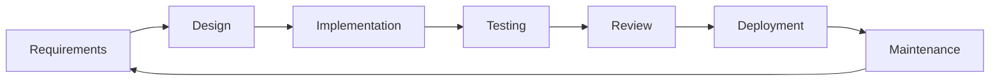
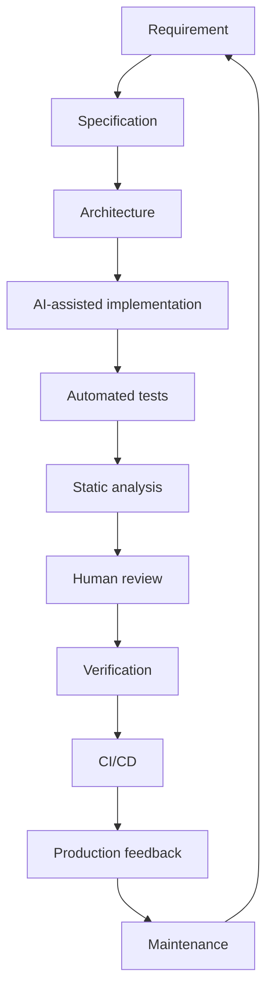
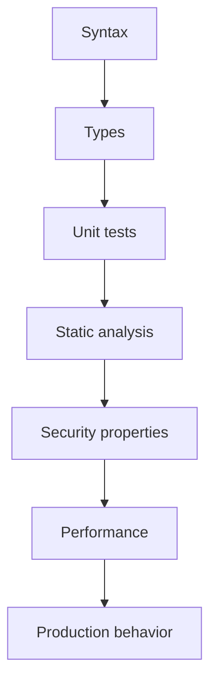
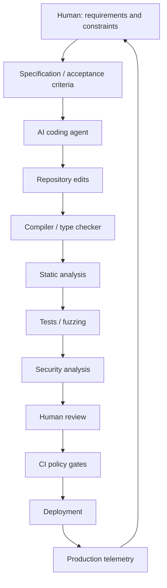

## Executive Summary

Programming has never been only about producing text that a compiler accepts. It has always included design under constraints, specification of intended behavior, testing against that intent, debugging when reality diverges, review by other humans, and long-term maintenance under changing requirements. What has changed is the cost and speed of producing candidate implementations.

Large language models and coding agents can now propose functions, refactor modules, generate tests, interpret stack traces, and, in more agentic setups, edit multiple files, run toolchains, and open pull requests. That capability is real and increasingly embedded in everyday development. It is also incomplete. Syntactic validity is not semantic correctness. High line coverage is not effective verification. A plausible patch is not a root-cause fix. Faster generation can accelerate both delivery and the accumulation of technical debt.

The central research question of this article is:

> When AI can generate, modify, test, review, and increasingly operate software, what does it mean to engineer software correctly?

The argument developed here is straightforward: AI does not eliminate software engineering. It changes where engineering effort is spent. As the cost of producing candidate code falls, the relative value of specification, architecture, constraints, testing strategy, static guarantees, human review, and accountability rises. Empirical work from DORA and independent studies shows both productivity gains and quality, review, and stability tensions. Treating generation as a substitute for engineering is a category error; treating it as a new layer inside an engineering system is the practical path.

This article examines the traditional engineering loop, the evolution toward agentic workflows, layers of correctness, testing and debugging under AI assistance, refactoring and migration, the complementary roles of static analysis and formal methods, human responsibility, failure modes, measurement, a reference architecture, a practical workflow, and a small reproducible lab. It is written from a programming and software-engineering perspective, not as a survey of tools or a forecast of automation.

---

## 1. Programming Before AI

For most of the history of professional software development, the dominant loop looked roughly like this:



Each stage carried distinct failure modes. Requirements could be ambiguous. Design could encode the wrong abstractions. Implementation could violate intended contracts. Tests could miss the behaviors that later failed in production. Review could be shallow. Deployment could expose operational assumptions that never appeared in the test environment. Maintenance could accumulate complexity until change became expensive.

Software engineering exists because writing code is the easy part relative to making systems correct, evolvable, and operable over time. Correctness is multi-dimensional: functional behavior, concurrency safety, resource management, API contracts, failure handling, performance under load, and security properties. Maintainability is a property of structure, naming, modularity, and the cost of future change. Operational feedback — logs, metrics, incidents — closes the loop that pure design-time reasoning cannot.

Human review has always been a bottleneck and a safeguard. It is slow, inconsistent, and essential. The same is true of debugging: isolation, hypothesis formation, and regression analysis require a model of the system that goes beyond the local diff. None of this disappears when generation becomes cheaper. Some of it becomes more important.

Another durable fact: most of the lifetime cost of software is incurred after the first release. Maintenance is not a residual activity; it is the main activity. Code that is easy to generate but hard to change shifts cost into the future. That is why maintainability, modularity, and clear ownership boundaries remain first-class engineering concerns even when the first draft arrives in seconds rather than hours.

---

## 2. From Code Generation to Agentic Software Engineering

AI assistance in programming has evolved through identifiable stages. The labels below are analytical, not product categories.

**Autocomplete.** Next-token or span prediction inside the editor. Low autonomy, high locality, easy to accept or reject.

**Code generation.** Prompted production of functions, classes, or small modules. Still mostly single-shot or short conversational turns.

**Conversational coding.** Multi-turn refinement: the developer describes intent, the model proposes, the developer corrects, the model revises.

**Repository-aware assistants.** Context drawn from open files, project structure, and sometimes retrieval over the codebase. The model can answer questions about existing code and propose changes that fit local style.

**Coding agents.** Systems that can plan multi-step tasks, inspect the repository, edit multiple files, invoke compilers and test runners, interpret failures, and retry. Some can open pull requests and interact with issue trackers.

**Autonomous multi-step software tasks.** Longer-horizon agents that attempt end-to-end work — issue resolution, migrations, test generation — with limited supervision. Research benchmarks (for example, repository-level SE task suites) measure progress; production reliability remains uneven.

What changes as systems move rightward on this spectrum is not only the volume of code produced, but the *interface* between human and machine. When an agent can modify many files and run tools, the human’s job shifts from typing to specifying intent, constraining the search space, and verifying outcomes.

Current capabilities should not be confused with research aspirations. Agents still fail on ambiguous requirements, deep architectural reasoning, and long-horizon consistency across services. They can pass local tests while violating undocumented invariants. They can open pull requests that look complete and still miss operational concerns (migrations, feature flags, rollback). Surveys of LLM-based agents for software engineering document rapid growth in papers, prototypes, and multi-agent frameworks, while also recording limits in reliability, evaluation methodology, and the gap between benchmark success and production-qualified change.

A practical distinction: **assistant mode** keeps the human in the edit loop for every meaningful decision; **agent mode** delegates a bounded task with explicit success criteria and mandatory verification. Most teams benefit from starting strict — short tasks, mandatory CI, mandatory human review — and expanding autonomy only where measurement shows the verification stack can absorb the volume.

---

## 3. The New Software Development Loop

A more accurate contemporary loop looks less like a pure human pipeline and more like a mixed system:



| Stage | What can be automated | What still needs engineering judgment |
| --- | --- | --- |
| Requirement / specification | Drafting, clarification questions | Ambiguity resolution, prioritization, risk acceptance |
| Architecture | Alternative sketches | Trade-offs, boundaries, evolution strategy |
| Implementation | Boilerplate, local transforms, first drafts | API design, invariants, cross-cutting concerns |
| Automated tests | Unit and some integration cases | Oracles, edge cases, property design |
| Static analysis | Linting, type errors, many bug patterns | Suppression policy, true-positive triage |
| Human review | Style and obvious defects (assisted) | Intent alignment, design critique |
| Verification | Regression suites, fuzz campaigns | Adequacy of the suite, production readiness |
| Maintenance | Routine refactors, dependency bumps (assisted) | Debt prioritization, semantic preservation |

The important observation is not that automation appears in every row. It is that **verification and judgment stages do not shrink proportionally with generation cost**. If anything, cheaper generation increases the rate at which unverified changes can enter the system.

---

## 4. Code Generation Is Not Code Correctness

Correctness is layered. Confusing layers is a common source of overconfidence in generated code.



**Syntactic correctness.** The code parses and, in compiled languages, type-checks at a basic level. Necessary; far from sufficient.

**Semantic / functional correctness.** The code implements the intended behavior for the relevant input space, including edge cases and failure modes.

**Concurrency and state correctness.** Shared-memory races, ordering assumptions, and distributed consistency are not visible in single-threaded happy-path tests.

**Resource and lifecycle correctness.** Handles, memory, file descriptors, connection pools, and cleanup paths.

**Contract correctness.** Pre- and post-conditions, API versioning, backward compatibility.

**Maintainability.** Structure that future humans (and agents) can change safely.

| Type of correctness | Example failure | Verification method |
| --- | --- | --- |
| Syntactic | Missing bracket, invalid token | Parser / compiler |
| Type / interface | Wrong argument type, missing field | Type checker |
| Functional (happy path) | Incorrect formula for common inputs | Unit tests |
| Functional (edge) | Empty collection, max int, Unicode | Targeted edge tests, properties |
| Concurrency | Race on shared counter | Thread sanitizers, stress tests, model checking |
| Resource | Leaked connection under error path | Integration tests, resource assertions |
| Security-sensitive | Missing authz check on new endpoint | Security review, SAST, adversary tests |
| Performance | Accidental O(n²) in hot path | Benchmarks, profiling |
| Maintainability | Duplicated policy logic across services | Review, architectural tests |

### Illustrative example A — merge

Consider a function that is supposed to merge two sorted lists of integers into a single sorted list without duplicates.

An implementation can compile, pass tests on small sorted inputs, and look idiomatic, while still being wrong on empty inputs, on inputs that are not actually sorted (if the contract requires validation), on integer overflow in length calculations, or on stability requirements that were never written down.

```python
# Illustrative — not claimed as model output
def merge_sorted(a: list[int], b: list[int]) -> list[int]:
    """Merge two sorted lists into one sorted list without duplicates."""
    i = j = 0
    out: list[int] = []
    while i < len(a) and j < len(b):
        if a[i] < b[j]:
            if not out or out[-1] != a[i]:
                out.append(a[i])
            i += 1
        elif b[j] < a[i]:
            if not out or out[-1] != b[j]:
                out.append(b[j])
            j += 1
        else:
            if not out or out[-1] != a[i]:
                out.append(a[i])
            i += 1
            j += 1
    # residual handling omitted in a weak draft
    return out
```

A weak generated test suite might only exercise non-empty, already-sorted, non-overlapping lists and report high line coverage. The residual tails, empty inputs, and duplicate-heavy cases remain untested. Coverage is high; verification is weak.

### Illustrative example B — concurrent counter

```python
# Illustrative race — looks fine in single-threaded tests
class Counter:
    def __init__(self) -> None:
        self.value = 0

    def increment(self) -> None:
        # read-modify-write is not atomic without a lock or atomic primitive
        self.value = self.value + 1
```

Unit tests that call `increment` on one thread will pass. Under concurrent load, updates are lost. An AI-generated “fix” that adds a retry loop or a sleep does not address the missing synchronization. The engineering response is to specify the concurrency contract and verify it with appropriate tools (locks, atomics, linearizability tests), not to iterate against a single-threaded suite until it stays green.

This is the general pattern: **generation optimizes for plausible local structure; engineering requires global intent and adversarial input design.**

---

## 5. AI and Software Testing

AI changes the economics of test production. Unit tests, property-based tests, and even some integration scenarios can be drafted quickly. That is useful. It is not the same as obtaining a reliable oracle.

Important distinctions:

- **Coverage** measures which lines or branches executed.
- **Effective verification** measures whether failures of the specification would be detected.

A generated suite can achieve high line coverage while encoding the same misconceptions as the implementation (test overfitting). Mutation testing is one way to probe this: if mutants survive, the suite is weak regardless of coverage percentage.

Practical testing layers that remain relevant:

| Technique | Role with AI assistance | Limitation |
| --- | --- | --- |
| Unit tests | Fast feedback on local behavior | Easy to overfit to generated code |
| Property-based tests | Explore input space via generators | Properties must be specified by humans |
| Fuzzing | Find crashes and assertion violations | Oracles often limited to “does not crash” |
| Integration / contract tests | Protect boundaries between components | Require stable interfaces and environments |
| Mutation testing | Evaluate suite strength | Computationally heavier; not a substitute for design |
| Regression suites | Guard against known past failures | Only as good as the failures already seen |

AI can propose tests; humans still own the definition of correct behavior. When acceptance criteria are vague, generated tests tend to be vague as well.

A useful discipline is to separate **implementation-derived tests** from **specification-derived tests**. The former are easy for a model to emit because they mirror the code that already exists. The latter require an independent statement of intent: properties, examples from the requirements document, historical production failures, and explicit adversarial cases. Teams that only generate tests from the implementation will systematically under-test the behaviors the implementation got wrong.

For integration and end-to-end layers, AI assistance is often most valuable at the edges: drafting fixture setup, suggesting assertions against API schemas, and proposing negative cases. The environment, data dependencies, and non-determinism remain human-owned problems. Flaky tests generated at high volume are not a productivity win; they are a tax on every subsequent change.

---

## 6. AI-Assisted Debugging

The classic debugging loop is:

failure → reproduce → isolate → hypothesize → patch → test → check for regressions

AI can help at several points: summarizing logs, suggesting likely locations, proposing patches, and generating regression tests for the observed failure. Empirical and practitioner reports also document failure modes:

- Fixing the symptom visible in the failing test while leaving the root cause intact.
- Editing unrelated code that happens to make the test pass.
- Introducing regressions outside the exercised path.
- Hallucinating APIs or configuration that do not exist in the project.
- Misreading architecture and “fixing” the wrong layer.

Debugging remains a system-level activity. Local patches without a model of data flow, ownership, and failure domains are a common source of brittle repairs. Agent workflows that iterate against a test suite can overfit that suite in the same way humans can — only faster.

---

## 7. AI-Assisted Refactoring and Code Migration

Large-scale change — language version upgrades, framework migrations, API renames, dependency updates — is a natural target for automation because much of the work is repetitive. The core technical problem is **semantic preservation**: the program after transformation should behave as required, not merely compile.

Evaluation of automated migration should include:

- Compilation and type-checking success rates.
- Existing test suite results (necessary but insufficient).
- Differential testing against the pre-migration behavior where possible.
- Review of intentional behavior changes versus accidental ones.
- Performance and resource profiles for sensitive paths.

Research and industrial reports on AI-assisted migration show promise on mechanical transformations and continued difficulty on changes that require cross-module reasoning or undocumented invariants. Treating a green CI run after a migration as proof of semantic equivalence is unsafe when the test suite was not designed as a characterization suite.

---

## 8. Static Analysis Meets AI

Compilers, type systems, linters, and static analyzers provide **deterministic** feedback. Given the same program and configuration, they produce the same diagnostics. AI systems provide **probabilistic** proposals. These are complementary, not substitutes.

| Mechanism | Guarantee style | Typical strength | Typical weakness |
| --- | --- | --- | --- |
| Type system / compiler | Hard errors on violated rules | Local consistency, many classes of misuse | Cannot express all domain invariants |
| Linters / static analyzers | Rule-based warnings | Style, common bug patterns, security smells | False positives; limited deep semantics |
| AI generation / review | Heuristic suggestions | Speed, breadth of patterns seen in training | Hallucination, inconsistency, no proof |
| Runtime tests | Empirical samples | Real execution behavior | Incomplete input space |

A sound engineering posture runs AI-proposed changes through the same deterministic gates used for human-written changes — and often adds stricter review when the change volume is high. Type errors and analyzer findings are not optional suggestions; they are part of the contract between the change and the codebase.

---

## 9. Formal Verification and AI-Generated Code

Formal methods — contracts, invariants, model checking, theorem proving — offer stronger guarantees than testing for the properties they can express. They are expensive to apply broadly and limited by the cost of specification.

AI-generated code increases the *relative* value of machine-checkable specifications in some settings: if implementation drafts are cheap, investing in a precise interface contract or a critical invariant can pay off by rejecting bad drafts automatically. That does not make full formal verification of entire applications practical for most teams. It does argue for:

- richer assertions and design-by-contract at module boundaries,
- property-based tests derived from explicit properties,
- model checking or specialized verification for concurrency and protocol-critical components,
- treating specifications as first-class artifacts that agents must satisfy, not as after-the-fact documentation.

The limitation remains: a proof is only as good as the specification. Wrong specs yield wrong guarantees.

---

## 10. The Human's Role Changes

As generation and multi-file editing become cheaper, the scarce resources shift toward:

- **Specification** — stating what must be true, including non-functional constraints.
- **Architecture** — choosing boundaries that keep change affordable.
- **Verification strategy** — designing tests and analyses that can falsify the implementation.
- **Review** — judging intent alignment, not only style.
- **System understanding** — knowing which invariants are load-bearing.
- **Accountability** — owning the decision to ship.

This is not a motivational claim about “higher-level work.” It is a description of where defects and costs concentrate when implementation drafts are abundant. Organizations that measure only generation volume will optimize for volume. Organizations that measure change-failure rate, escape defects, and maintenance burden will optimize for engineering outcomes.

---

## 11. The New Failure Modes of AI-Assisted Programming

Empirical studies of AI-generated and AI-assisted code in the wild report recurring issue classes: code smells at high volume, correctness defects, security-relevant patterns, and surviving issues that remain in repositories over time. Comparative analyses of pull requests have found higher issue density in AI-co-authored changes in some datasets, including logic and correctness categories. Results vary by study design, language, and tool; the consistent theme is that **generation does not automatically inherit the quality distribution of careful human authorship**.

| Failure mode | Why it happens | Detection | Mitigation |
| --- | --- | --- | --- |
| Hallucinated APIs | Training prior ≠ project reality | Compile/type errors; integration tests | Deterministic gates before review |
| Incomplete implementations | Optimistic stopping | Edge-case tests; code review | Explicit acceptance criteria |
| Test overfitting | Tests generated from same assumptions | Mutation testing; independent oracles | Separate property design from implementation |
| Hidden regressions | Narrow test focus | Broader regression + differential testing | Characterization suites for migrations |
| Architecture drift | Local edits without global design | Review of cross-module diffs | Architectural tests; ownership boundaries |
| Technical debt acceleration | High volume of shallow fixes | Maintainability metrics; issue survival | Debt budgets; stricter review on hot paths |
| Insecure defaults | Common insecure patterns in training data | SAST, dependency scanning, security review | Secure defaults in templates and policy |

Faster production of code can mean faster production of debt if verification capacity does not scale with generation capacity.

---

## 12. Measuring AI-Assisted Programming

Raw output metrics are poor proxies for engineering progress.

| Metric | What it measures | What it misses | Better interpretation |
| --- | --- | --- | --- |
| Lines of code / commits | Volume of change | Value, correctness, durability | Normalize by outcome, not output |
| PR throughput | Flow of changes | Quality of those changes | Pair with change-failure rate |
| Cycle time | Speed of delivery | Stability after delivery | Use with incident and rollback rates |
| Test coverage % | Executed structure | Oracle quality | Supplement with mutation score |
| Review time | Attention cost | Review depth | Track escaped defects post-merge |
| Defect rate / change-failure rate | Quality outcomes | Causes | Segment by AI-assisted vs not where possible |
| Developer cognitive load | Human cost | Long-term skill effects | Survey + outcome metrics together |

DORA research on AI-assisted development has reported widespread adoption and self-reported productivity gains, alongside nuances around delivery stability, trust in generated code, and the amplifying effect of AI on existing organizational strengths and weaknesses. In the 2024 research cycle, higher AI adoption was associated in the reported models with small negative movements in some delivery throughput and stability estimates, even as individual productivity and documentation or review speed indicators moved positively in related analyses. The 2025 report, drawing on a larger international sample, describes AI adoption near 90% among surveyed professionals, substantial self-reported productivity benefits, and a persistent trust gap: a non-trivial share of respondents report low trust in AI-generated code even while using it daily. A recurring organizational finding is that AI amplifies existing system quality — strong platforms and clear workflows capture more value; weak systems surface dysfunction faster.

These results are associations from survey and qualitative research, not laboratory proofs of causation for every team. They are nonetheless more informative than vendor anecdotes. Independent academic and industry analyses add complementary signals: some controlled and observational studies find higher issue density or distinct defect profiles in AI-assisted changes; others find productivity gains concentrated among less experienced contributors while review and rework load shifts toward core maintainers. Lab studies from tool vendors have reported improved task completion and higher rates of unit-test passage under assisted conditions; those settings typically differ from long-lived production codebases with accumulated architecture constraints.

The durable methodological lesson is: **measure outcomes and system properties, not only activity.** Throughput without change-failure rate is incomplete. Coverage without mutation or independent oracles is incomplete. Developer satisfaction without escape-defect tracking is incomplete. Organizations that instrument only generation volume will obtain more volume.

---

## 13. A Reference Architecture for AI-Assisted Software Engineering



The architectural principle is simple: **AI operates inside engineering constraints rather than around them.** Generation is upstream of deterministic gates. Human review remains a control point for intent. Production telemetry feeds the next cycle of specification. Bypassing gates for speed recreates the failure modes already observed when any high-volume change process skips verification.

---

## 14. Practical Engineering Workflow

A workflow a professional team can actually run:

1. **Define the requirement** in terms of user-visible behavior and constraints (latency, compatibility, threat model).
2. **Write acceptance criteria** that can fail — not only narrative goals.
3. **Establish constraints** (languages, libraries, style, security baseline, performance budgets).
4. **Ask for a design sketch** before a large implementation, especially for cross-module work.
5. **Review the design** for boundary choices and failure modes.
6. **Generate or draft implementation** within those constraints.
7. **Run the compiler / type checker** and fix hard errors before further investment.
8. **Run static analysis** and treat actionable findings as blocking where policy says so.
9. **Generate tests**, then **add human-designed edge cases and properties**.
10. **Run the suite**; investigate failures without simply regenerating until green.
11. **Perform security-sensitive review** on auth, crypto, serialization, and IO boundaries.
12. **Review the diff** for intent, not only for style.
13. **Validate edge cases** that tests may still miss (concurrency, partial failure).
14. **Merge under CI policy**.
15. **Monitor production** for the behaviors the change claimed to improve.

Every stage exists because a cheaper stage upstream can flood a weaker stage downstream. The workflow is a rate limiter for defects, not a ritual.

---

## 15. Practical Mini-Lab

This small experiment demonstrates the gap between line coverage and effective verification. It is reproducible locally with Python 3 and `pytest`. No AI API is required; the “generated” tests are deliberately weak stand-ins for an overfitted suite.

### 15.1 Implementation under test

```python
# invoice.py
from dataclasses import dataclass

@dataclass
class LineItem:
    sku: str
    qty: int
    unit_price_cents: int

def invoice_total_cents(items: list[LineItem], tax_bps: int) -> int:
    """
    Return total cents including tax.
    tax_bps is basis points (10000 = 100%).
    """
    if tax_bps < 0:
        raise ValueError("tax_bps must be non-negative")
    subtotal = 0
    for it in items:
        if it.qty < 0 or it.unit_price_cents < 0:
            raise ValueError("qty and unit_price_cents must be non-negative")
        subtotal += it.qty * it.unit_price_cents
    # Intentionally simplistic tax path for the exercise
    tax = (subtotal * tax_bps) // 10000
    return subtotal + tax
```

### 15.2 Weak generated-style tests (high coverage, weak oracle)

```python
# test_invoice_weak.py
from invoice import LineItem, invoice_total_cents

def test_single_item_no_tax():
    items = [LineItem("a", 2, 100)]
    assert invoice_total_cents(items, 0) == 200

def test_two_items_with_tax():
    items = [LineItem("a", 1, 1000), LineItem("b", 1, 500)]
    # 1500 + 10% = 1650
    assert invoice_total_cents(items, 1000) == 1650
```

These tests execute most lines and pass. They do not explore empty lists, zero quantities, rejection of negative inputs, or rounding behavior at boundaries.

### 15.3 Stronger tests

```python
# test_invoice_strong.py
import pytest
from invoice import LineItem, invoice_total_cents

def test_empty_invoice():
    assert invoice_total_cents([], 1000) == 0

def test_rejects_negative_qty():
    with pytest.raises(ValueError):
        invoice_total_cents([LineItem("a", -1, 100)], 0)

def test_rejects_negative_tax():
    with pytest.raises(ValueError):
        invoice_total_cents([LineItem("a", 1, 100)], -1)

def test_tax_rounding_truncation():
    # 1 * 1 * 1 bps -> tax 0 with integer division
    assert invoice_total_cents([LineItem("a", 1, 1)], 1) == 1
```

### 15.4 What the lab shows

Run:

```bash
pytest test_invoice_weak.py --cov=invoice --cov-report=term-missing
pytest test_invoice_strong.py
```

The weak suite can look healthy on coverage while missing contract behavior. The stronger suite encodes intent. When AI generates tests, the engineering task is to ensure the suite embodies the specification — not merely that coverage numbers rise.

*(Commands above are standard `pytest` invocations; adapt paths and install `pytest-cov` if you measure coverage. Outputs are not fabricated here.)*

---

## 16. Security and Reliability Intersection

Programming correctness and security correctness overlap on the same mechanisms: input validation, memory and resource safety, authorization checks, concurrency control, serialization boundaries, and error handling. AI-assisted coding does not remove the need for those disciplines; it changes the rate at which code touching them appears in review queues.

Keep security review focused on the same engineering artifacts already in the loop — types, tests, static analysis, and human inspection of sensitive diffs — rather than treating “AI security” as a separate product category inside an otherwise unchanged process. Reliability follows the same pattern: explicit failure modes, timeouts, retries with jitter, and idempotency are specification and design problems before they are generation problems.

---

## 17. What AI Still Cannot Reliably Replace

Current systems remain weak where:

- Requirements are ambiguous or political.
- Architecture must encode multi-year evolution, not only the next feature.
- Invariants are undocumented and only known through operational history.
- Trade-offs involve product, legal, or organizational constraints outside the repository.
- Accountability for failure must sit with a human decision-maker.
- Long-horizon consistency across many services and data models is required.

These are not permanent metaphysical limits; they are observed practical limits given today’s models, tools, and evaluation methods. Engineering organizations should plan as if verification, review, and accountability remain scarce even when tokens are cheap.

---

## 18. Future of Programming

Near-term developments that are already visible:

- Tighter integration of agents with repository tooling, CI, and review systems.
- Better retrieval and workspace awareness reducing some classes of hallucination.
- Wider use of AI for test drafting, migration assistance, and review triage.
- Organizational patterns that require design approval before large autonomous edits.

Research-frontier directions:

- Machine-checkable specifications that agents must satisfy by construction.
- Proof-oriented or strongly verified generation for critical modules.
- Continuous autonomous maintenance loops with human policy control planes.
- Better benchmarks that measure production-qualified change, not only benchmark-task success.

The trajectory that matters for engineering is not “full autonomy.” It is **raising the quality of the interface between probabilistic generation and deterministic verification**.

---

## Conclusion

As the cost of producing candidate code falls, the cost of being wrong does not fall with it. Software engineering remains the discipline of building systems that behave correctly under constraints, evolve under change, and remain operable under failure. AI alters the shape of the work: more time specifying and verifying, less time typing boilerplate, higher risk of volume-driven debt if gates are weak.

Code generation is a component. Software engineering is the system that turns components into reliable behavior over time. Teams that install generation without installing commensurate verification will ship faster and repair more. Teams that treat AI as a powerful collaborator inside a rigorous loop — specification, architecture, deterministic analysis, tests with real oracles, human review, production feedback — will capture the productivity benefits without discarding the practices that made software engineering necessary in the first place.

The evidence available through 2025–2026 supports a measured conclusion rather than a slogan. Adoption is widespread. Self-reported productivity gains are common. Quality and delivery outcomes are mixed and depend heavily on the surrounding engineering system. Trust in generated code lags use. Review and maintenance burdens do not automatically shrink. Those facts are compatible with a future in which AI is indispensable infrastructure — and incompatible with a future in which verification is optional.

The future programmer may write fewer lines by hand. They will still be responsible for what those lines mean.

---

## References

1. DeBellis, D., Storer, K., Harvey, N., et al. *DORA 2025 State of AI-assisted Software Development Report*. Google / DORA, 2025.  
2. DORA / Google Cloud. *2024 DORA Report* highlights on AI adoption, productivity, and delivery performance. 2024.  
3. GitHub Research. Studies on Copilot and code quality / developer productivity (lab and field results). 2023–2024.  
4. Empirical studies on AI-generated code quality, defects, and technical debt in real repositories (2025–2026 arXiv and SE venue literature), including large-scale analyses of AI-authored commits and PR issue density.  
5. ACM / IEEE surveys on LLM-based agents for software engineering (agent capabilities, multi-agent setups, evaluation limits).  
6. Research on AI-assisted programming productivity and maintenance burden in open-source settings (experience-stratified effects on core vs peripheral contributors).  
7. Classical software engineering foundations on verification, testing adequacy, and mutation analysis (for the coverage-vs-oracle distinction).  
8. Static analysis and type-system literature on deterministic guarantees complementary to probabilistic generation.

*Empirical claims about adoption rates, productivity, and quality are attributed to the cited research programs and studies. Survey self-reports and lab studies measure different constructs than production change-failure rates; where sources report association rather than causation, that distinction is preserved in the body text.*
