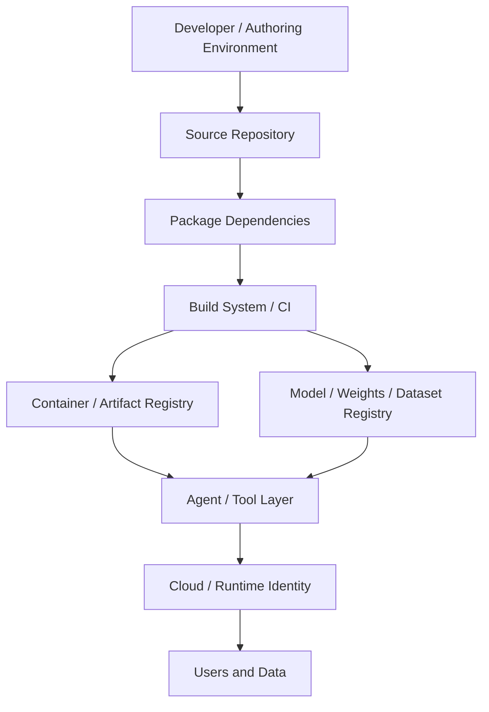

## 1. Executive Summary

Modern applications are no longer assembled primarily from source repositories and package-manager dependencies. AI-native systems introduce additional classes of artifacts and trust decisions: foundation models, fine-tuned weights, adapters, training and evaluation datasets, prompts and system instructions, agent tools and plugins, vector stores, third-party inference APIs, generated code, containers, CI/CD pipelines, and cloud identities. Each of these objects carries its own provenance story, integrity requirements, and failure modes.

The central research question of this article is:

> If modern applications contain code, dependencies, containers, models, datasets, agents, tools, identities, and cloud infrastructure, how should engineering and security teams establish and continuously verify trust across the entire chain?

Traditional software composition analysis, lockfiles, and vulnerability databases remain necessary but are no longer sufficient. An SBOM that lists npm or PyPI packages does not describe the model weights an agent loads at runtime, the dataset used for fine-tuning, or the authorization policy governing which tools an autonomous agent may invoke. Signatures prove integrity of an artifact; they do not prove that the artifact’s behavior is benign or that its training data was unpoisoned. Provenance attests to how an artifact was built; it does not guarantee that the source components themselves were trustworthy.

This article develops a layered anatomy of the AI-native supply chain, a threat model organized around explicit trust boundaries, realistic attack scenarios, a practical verification laboratory, a reference architecture, and a control matrix mapped where appropriate to NIST, CISA, SLSA, and OpenSSF guidance. It treats supply-chain security as continuous verification of assumptions across a graph of artifacts and identities rather than as a one-time scanning step.

---

## 2. Why the Software Supply Chain Has Changed

For roughly two decades the dominant mental model of the software supply chain was:

```
Source repository → package dependencies → build → binary/container → deployment
```

That model already contained serious weaknesses—transitive dependencies, registry trust, compromised maintainers, and poisoned build systems—but it was still largely about *code*. The artifacts were source files, compiled binaries, and container images whose behavior could, at least in principle, be inspected, tested, and scanned.

AI-native applications expand the set of objects that must be trusted:

- Foundation and fine-tuned models (often multi-gigabyte binary weight files)
- Adapters (LoRA, QLoRA, and similar parameter-efficient updates)
- Datasets and their lineage
- Embedding indexes and vector databases
- System prompts and instruction templates treated as configuration
- Agent frameworks, tools, and plugins that execute actions
- External inference and tool APIs
- Code generated by models and subsequently committed or executed

These objects differ from traditional packages in several security-relevant ways. Model weights are opaque; their behavior is statistical rather than deterministic. Datasets may be scraped, licensed under complex terms, or quietly modified after publication. Agent tools often bridge into privileged infrastructure—cloud APIs, internal services, databases—under the identity of the agent runtime. Generated code can re-introduce dependency or configuration risks that earlier scanning steps already “cleared.”

The result is a longer chain of trust decisions. A developer who once only needed to reason about “is this package version safe?” must now also reason about “is this model the one we intended, has it been modified, what data was it trained on, which tools is the agent allowed to call, and does the runtime still enforce those constraints after deployment?”

Traditional dependency security is still required. It is simply no longer the complete surface.

---

## 3. Anatomy of an AI-Native Software Supply Chain

The following layered model is used throughout the rest of the article. Each layer answers six questions: what is trusted by default, what is untrusted, what can be modified, what can be impersonated, what must be verified, and what telemetry should exist.



### 3.1 Developer / Authoring Environment

Trusted by default in most organizations: the developer’s workstation and local tooling.  
Untrusted in a rigorous model: any local package cache, browser-downloaded model, or clipboard-sourced prompt.  
Modifiable: local source, local model caches, environment variables, and secrets.  
Impersonatable: developer identity (stolen credentials, malware).  
Must verify: commit signatures where used, local secret scanning, approved model sources.  
Telemetry: endpoint detection, unusual outbound connections during dependency or model download.

### 3.2 Source Repository

Trusted: the repository as the system of record for intended source.  
Untrusted: external contributors, compromised maintainer accounts, unsigned commits.  
Modifiable: source history, branch protection rules, CI configuration files.  
Impersonatable: commit authors (without signature verification).  
Must verify: signed commits or verified authorship, protected branches, required reviews.  
Telemetry: unexpected force-pushes, new maintainers, CI configuration changes.

### 3.3 Package Dependencies

Trusted: packages listed in lockfiles after policy review.  
Untrusted: newly resolved transitive dependencies, public registry content.  
Modifiable: package contents on the registry, lockfile updates.  
Impersonatable: package names (typosquatting, dependency confusion).  
Must verify: lockfile integrity, allow-list or deny-list policy, vulnerability and malware scanning.  
Telemetry: unexpected version changes, new packages, post-install network activity.

### 3.4 Build System / CI

Trusted: the defined pipeline as the authorized transformation from source to artifact.  
Untrusted: self-hosted runners, unvetted third-party actions, secrets available to every job.  
Modifiable: pipeline definition, runner environment, intermediate artifacts.  
Impersonatable: pipeline identity used for publishing.  
Must verify: provenance attestations (e.g., SLSA), hermetic or controlled builds, least-privilege secrets.  
Telemetry: unexpected job definitions, runner privilege escalations, artifact digests that diverge from expected.

### 3.5 Container / Artifact Registry

Trusted: images and packages that carry verified signatures and provenance.  
Untrusted: unsigned images, images from public registries without verification.  
Modifiable: image layers after push (if registry allows overwrite).  
Impersonatable: image tags and digests if not pinned and verified.  
Must verify: signature, provenance, and policy before promotion or deployment.  
Telemetry: unsigned pushes, tag mutations, unexpected digests.

### 3.6 Model / Weights / Dataset Registry

Trusted: models whose publisher identity, content digest, and (where available) training provenance are known and accepted.  
Untrusted: arbitrary downloads from public model hubs, unsigned weight files, undocumented fine-tunes.  
Modifiable: weight files, adapter files, accompanying config or tokenizer files.  
Impersonatable: model names and repository identities on public hubs.  
Must verify: cryptographic hash or signature of weights, publisher identity, license and dataset lineage where claimed.  
Telemetry: unexpected model downloads, hash mismatches, new model versions pulled into production pipelines.

### 3.7 Agent / Tool Layer

Trusted: tools and plugins that have been authorized for a given agent identity and runtime policy.  
Untrusted: dynamic tool registration, third-party plugins, tools that accept free-form parameters leading to privileged actions.  
Modifiable: tool implementations, tool descriptions that influence model routing, authorization policy.  
Impersonatable: tool identities presented to the model.  
Must verify: tool allow-lists, parameter validation, runtime authorization decisions.  
Telemetry: tool invocation logs, unexpected tools, privilege escalations via tool use.

### 3.8 Cloud / Runtime Identity

Trusted: short-lived, least-privilege credentials issued to specific workloads.  
Untrusted: long-lived keys, overly broad IAM roles, shared service accounts.  
Modifiable: IAM policies, secret values, network policies.  
Impersonatable: workload identities if the identity system itself is compromised or misconfigured.  
Must verify: identity issuance, policy evaluation, and continuous monitoring of granted permissions.  
Telemetry: anomalous API calls, credential use outside expected patterns, privilege changes.

### 3.9 Users and Data

Trusted: authenticated and authorized user sessions and data subject to policy.  
Untrusted: unauthenticated input, including prompts that may contain injection payloads aimed at agents.  
Modifiable: user data, conversation history that later becomes context.  
Impersonatable: user identity under account takeover.  
Must verify: authentication strength, authorization at the data layer, input validation and prompt isolation.  
Telemetry: authentication anomalies, unusual data access, agent actions taken on behalf of users.

---

## 4. Trust Boundaries

A trust boundary is a point at which control or data crosses from one security context into another and an assumption must hold for the system to remain safe. In an AI-native supply chain the important boundary types include:

- **Artifact boundary** — integrity and authenticity of a package, image, model weight file, or dataset.
- **Provenance boundary** — claims about how an artifact was produced (builder identity, source commit, build parameters).
- **Identity boundary** — the principal under which a process, agent, or tool operates.
- **Authorization / policy boundary** — decisions about what an identity is allowed to do with a given tool or resource.
- **Runtime boundary** — the isolation and monitoring guarantees of the execution environment.

The following table summarizes representative threats at each major component.

| Component | Threat | Attacker Capability | Impact | Detection | Mitigation |
| --- | --- | --- | --- | --- | --- |
| Package registry | Typosquatting / dependency confusion | Publish similarly named package | Code execution in build or runtime | Unexpected package names, network callbacks from install | Scoped registries, lockfiles, allow-lists, malware scanning |
| CI runner | Compromised runner or malicious action | Modify build outputs or exfiltrate secrets | Poisoned artifacts, credential theft | Provenance mismatch, anomalous runner behavior | SLSA-aligned builders, ephemeral runners, least-privilege secrets |
| Model hub | Poisoned or substituted weights | Upload or replace model files | Backdoored or degraded model behavior | Hash/signature mismatch, unexpected publisher | Signed models, verified digests, approved-source policy |
| Agent tool | Malicious or over-privileged tool | Register or invoke tool with elevated rights | Lateral movement, data exfiltration | Unexpected tool calls, policy violations | Tool allow-lists, parameter schemas, runtime authorization |
| Cloud identity | Over-privileged or leaked credential | Use standing credentials | Broad resource access | Anomalous API usage, unusual locations | Short-lived credentials, least privilege, continuous monitoring |
| Prompt / input | Prompt injection influencing tool use | Craft input that alters agent planning | Unauthorized tool invocation | Unusual tool sequences, guardrail triggers | Input isolation, tool confirmation, output filtering |

---

## 5. The Traditional Software Supply Chain

Even before AI artifacts, the conventional supply chain already presented a substantial attack surface.

Package managers resolve both direct and transitive dependencies. Lockfiles pin versions and, when used correctly, provide a reproducible resolution. Registries (npm, PyPI, Maven Central, crates.io, etc.) are trusted intermediaries; their compromise or abuse enables widespread impact. Build systems transform source plus dependencies into artifacts; any modification of the build environment can alter the output without changing the source that was reviewed. Containers package the result; image registries become additional distribution points.

Documented attack patterns include:

- **Dependency confusion** — publishing a public package with the same name as an internal package so that resolution prefers the public (malicious) version.
- **Typosquatting** — registering names that are small edit-distance or visually confusable variants of popular packages.
- **Malicious packages** — packages whose install-time or runtime behavior is intentionally harmful (credential theft, reverse shells, cryptomining).
- **Compromised maintainer accounts** — takeover of a legitimate package’s publishing credentials, followed by a malicious release under the trusted name.
- **Compromised CI runners or actions** — modification of build outputs or theft of secrets available to the pipeline.
- **Poisoned build artifacts** — substitution or alteration of the final binary or image after the source review but before deployment.

These patterns are not theoretical. Public research and incident reporting have repeatedly demonstrated dependency confusion against large organizations, large-scale typosquatting campaigns on npm and PyPI, and high-impact maintainer or build-system compromises. Defenses that address them—lockfiles, private registry proxies, package allow-lists, reproducible builds, and signed provenance—remain foundational when AI artifacts are added; they simply become one layer among several.

---

## 6. Where AI Changes the Model

AI systems introduce objects that do not fit cleanly into the traditional package model.

**Foundation models and fine-tunes.** Multi-gigabyte weight files are distributed through model hubs. Their internal representations are not source code; static analysis and conventional SCA tools do not apply in the same way. A fine-tune or adapter may be only a few megabytes yet completely change behavior relative to the base model.

**Datasets.** Training and evaluation data may be public, proprietary, scraped, or derived. Dataset poisoning and license/compliance issues are first-class concerns. Provenance of the data is often weaker than provenance of code.

**Prompts and system instructions.** These are configuration, yet they exert strong control over model behavior and tool selection. They are easily modified, versioned poorly in many organizations, and can themselves be the target or the vector of injection attacks.

**Agent tools and plugins.** Tools turn language-model output into side effects: API calls, database queries, code execution, file system access. A tool is effectively a privileged capability granted to a probabilistic controller. The trust decision is no longer only “is this code safe?” but “is this capability authorized for this agent identity under these conditions?”

**Generated code.** Models produce source that is subsequently reviewed, committed, or even executed automatically. That code can reintroduce dependency risks, insecure patterns, or subtle logic errors that earlier supply-chain controls did not examine.

**External inference and tool APIs.** When an application calls a third-party model or tool endpoint, that service becomes an opaque dependency. Its own supply chain, training data, and logging practices are largely invisible to the caller.

These objects expand both the *artifact* surface and the *identity/authorization* surface. Controls that only inventory traditional packages miss the majority of the new surface.

---

## 7. AI Model Provenance

Provenance for a model answers a set of related but distinct questions:

- Where did this artifact come from (publisher, repository, version)?
- Who authorized its publication (identity bound to a signature or attestation)?
- How was it produced (base model, fine-tuning procedure, training data claims)?
- Has the binary content been modified since publication (integrity)?
- What claims about its properties can be independently checked?

It is essential not to collapse four different properties:

- **Integrity** — the bits have not changed (hash or signature verification).
- **Authenticity** — the artifact was produced or published by a claimed identity.
- **Provenance** — a recorded history of the transformation steps and inputs that produced the artifact.
- **Trustworthiness** — a judgment, informed by the above plus evaluation and operational evidence, that the artifact is suitable for a given use.

A correct hash proves integrity. A valid signature from a known publisher proves authenticity of that publisher’s claim. Neither proves that the model was trained on clean data, that it lacks backdoors, or that its behavior will remain acceptable under distribution shift. Provenance metadata improves the ability to reason about the first three properties; trustworthiness remains a risk decision that must incorporate evaluation, monitoring, and organizational policy.

Practical provenance metadata for models includes:

- Content digest(s) of weight files and critical accompanying artifacts (tokenizer, config).
- Publisher identity and signature (Sigstore/cosign-style or equivalent).
- Base model identifier and version when the artifact is a fine-tune or adapter.
- Claims about training or alignment data (even if incomplete).
- License and intended-use statements.
- Build or training pipeline identity when SLSA-style attestations are available.

Projects such as Sigstore’s model-signing work demonstrate that large model files can be signed and verified with practical performance, binding the digest to a workload or publisher identity and recording the signature in a transparency log. That is a meaningful integrity and authenticity control; it is not a complete answer to trustworthiness.

---

## 8. SBOM → AI/ML SBOM

A traditional Software Bill of Materials is a formal, machine-readable inventory of components that make up a software artifact. NTIA’s original minimum elements and subsequent CISA updates established expectations around supplier, component name, version, identifiers, relationships, and (in later guidance) hashes, licenses, and generation context.

Because AI systems are software systems, the general SBOM minimum elements continue to apply to the conventional code and package layers. CISA and G7 partners have additionally published *Software Bill of Materials for AI – Minimum Elements* (May 2026). That guidance is explicit that AI-specific recommendations are *supplemental* to the general SBOM minimum elements; they do not replace them.

The AI-oriented elements address the additional inventory needs of models and related artifacts: model components, datasets, versioning of models, licenses, supplier identity, artifact hashes, and available training or provenance information. Complementary technical formats exist in the ecosystem—CycloneDX’s Machine Learning Bill of Materials (ML-BOM) capabilities and SPDX’s AI and Dataset profiles—providing concrete schema support for describing models, datasets, and their relationships alongside traditional software components.

An AI/ML SBOM (or an SBOM that includes ML-BOM sections) improves transparency and speeds response when a component is later found to be vulnerable or malicious. It does **not**:

- prove that any listed component is free of vulnerabilities or backdoors,
- substitute for runtime behavioral evaluation of a model,
- guarantee that training-data claims are complete or accurate,
- or eliminate the need for identity, authorization, and runtime controls around agents and tools.

Used correctly, it is evidence infrastructure that makes other controls more effective. Used as a checkbox, it creates a false sense of coverage.

---

## 9. Build Provenance and Artifact Signing

Three related but distinct mechanisms appear repeatedly in modern supply-chain guidance:

- **Content digests** (cryptographic hashes) identify an artifact unambiguously.
- **Signatures** bind a digest to an identity (publisher or builder).
- **Attestations / provenance** make structured claims about how the artifact was produced (source commit, builder identity, parameters, dependencies).

SLSA (Supply-chain Levels for Software Artifacts), developed under OpenSSF, organizes increasing levels of assurance around build integrity. Higher levels require stronger isolation of the build service, non-falsifiable provenance, and (at the highest levels) hermetic and reproducible builds. SLSA does not claim that a high-level artifact is free of vulnerabilities in its dependencies; it claims that the artifact matches the described build process and has not been tampered with after that process.

Sigstore and its cosign tool provide practical signing and verification infrastructure, including keyless signing bound to OIDC identities and recording in a transparency log (Rekor). The same infrastructure has been extended to model signing, allowing model weights to be treated as first-class signed artifacts.

These mechanisms are complementary:

- Digests detect modification.
- Signatures and transparency logs support authenticity and discovery of who signed what.
- Provenance attestations support verification that the artifact came from an expected pipeline.

None of them, alone, answers whether the resulting system should be trusted for a particular high-stakes use. They raise the cost of undetected tampering and make forensic investigation feasible.

---

## 10. Threat Scenarios

### Scenario A — Malicious transitive dependency

**Initial access.** Attacker publishes a package that is pulled in as a transitive dependency of a popular library, or uses dependency confusion against an internal name.  
**Trust assumption.** “Our direct dependencies are reviewed; the lockfile protects us.”  
**Attack path.** Install-time or import-time code executes in CI or on developer workstations, steals tokens, or modifies build outputs.  
**Boundary crossed.** Package artifact boundary and, potentially, CI identity boundary.  
**Impact.** Credential theft, poisoned artifacts, or persistent access.  
**Detection.** Unexpected new packages, post-install network activity, malware scanning of dependencies.  
**Mitigation.** Strict lockfiles, private registry proxies or allow-lists, install-time behavioral analysis, SLSA provenance so that downstream consumers can detect unexpected build inputs.

### Scenario B — Compromised CI runner

**Initial access.** Attacker compromises a self-hosted runner or a widely used third-party GitHub Action.  
**Trust assumption.** “The pipeline definition we reviewed is what actually runs.”  
**Attack path.** Modified build steps alter the released binary or image, or exfiltrate signing keys and secrets.  
**Boundary crossed.** Build provenance boundary; artifact integrity boundary.  
**Impact.** Signed-but-malicious releases, or widespread secret exposure.  
**Detection.** Provenance that does not match expected builder identity or source commit; anomalous runner behavior.  
**Mitigation.** Ephemeral, isolated builders; signed and verified provenance; least-privilege secrets; required reviews of pipeline changes.

### Scenario C — Poisoned model artifact

**Initial access.** Attacker uploads a model to a public hub under a name that collides with or closely resembles a popular model, or compromises an existing publisher account.  
**Trust assumption.** “We downloaded the model everyone else uses.”  
**Attack path.** Application or fine-tuning pipeline loads the weights; model exhibits backdoor behavior or degraded safety properties under specific triggers.  
**Boundary crossed.** Model artifact and publisher authenticity boundaries.  
**Impact.** Silent failure of safety properties, data exfiltration via model behavior, or downstream systems acting on malicious outputs.  
**Detection.** Hash or signature verification failure; unexpected publisher identity; behavioral evaluation against known triggers.  
**Mitigation.** Approved-source lists, mandatory digest/signature verification before use, model cards and provenance metadata, evaluation suites before promotion.

### Scenario D — Malicious model or plugin in an agent workflow

**Initial access.** A plugin or tool description is added to an agent’s toolset, or a model is updated to prefer a malicious tool.  
**Trust assumption.** “Tools are just functions; the model decides when to call them.”  
**Attack path.** The agent is induced (via prompt or tool description) to invoke the malicious tool, which performs privileged actions.  
**Boundary crossed.** Agent/tool authorization boundary.  
**Impact.** Unauthorized actions under the agent’s identity.  
**Detection.** Tool invocation logs that violate policy; unexpected tools appearing in traces.  
**Mitigation.** Explicit tool allow-lists per agent identity, schema validation of tool arguments, human confirmation for high-impact tools, runtime policy enforcement.

### Scenario E — Agent tool as bridge into privileged infrastructure

**Initial access.** Legitimate agent has a tool that can call internal APIs or cloud services.  
**Trust assumption.** “The agent only does what users ask.”  
**Attack path.** Prompt injection or indirect injection causes the agent to issue tool calls that escalate privilege or move data.  
**Boundary crossed.** Runtime authorization and identity boundaries.  
**Impact.** Data exfiltration, privilege escalation, or lateral movement under a trusted workload identity.  
**Detection.** Anomalous tool sequences, unusual data access patterns, guardrail or policy violations.  
**Mitigation.** Least-privilege tool credentials, strict parameter validation, separation of agent identity from high-privilege credentials, continuous monitoring of agent actions.

---

## 11. Practical Lab

The following laboratory exercises demonstrate defensive verification steps that a security engineer can reproduce locally. They are intentionally non-destructive.

### 11.1 Dependency lockfile and SBOM generation

Using a small Node.js or Python project with a lockfile:

```bash
# Example with syft (Anchore) for SBOM generation — install via official docs
syft dir:. -o cyclonedx-json > sbom.cdx.json

# Or with cdxgen
cdxgen -t javascript -o sbom.cdx.json
```

Inspect the SBOM for unexpected components and confirm that lockfile hashes match resolved packages. This demonstrates inventory, not safety.

### 11.2 Artifact hashing

```bash
sha256sum path/to/artifact.tar.gz
# or
openssl dgst -sha256 path/to/model.safetensors
```

Record the digest as the expected value for later verification gates.

### 11.3 Container image verification (Cosign)

Assuming an image that has been signed with Sigstore/cosign:

```bash
cosign verify \
  --certificate-identity=expected-identity@example.com \
  --certificate-oidc-issuer=https://token.actions.githubusercontent.com \
  ghcr.io/org/image:tag
```

A successful verification confirms that the image digest matches a signature bound to the expected identity. It does not prove the image is free of vulnerabilities.

### 11.4 Model digest verification

```bash
# After downloading a model, compare against a published digest
sha256sum model.safetensors
# Compare to the digest recorded in an approved-model inventory or signature bundle
```

Where model-signing tooling is available:

```bash
# Conceptual usage aligned with Sigstore model-signing projects
model_signing verify ${MODEL_PATH} \
  --signature ${SIGNATURE} \
  --identity ${EXPECTED_IDENTITY} \
  --identity_provider ${OIDC_PROVIDER}
```

### 11.5 Provenance inspection

For artifacts that carry SLSA provenance attestations, use the appropriate verifier (cosign, slsa-verifier, or platform-native tools) to confirm that the builder identity, source repository, and commit match organizational policy before promotion.

These steps form a minimal verification gate. In production they should be enforced by policy engines rather than ad-hoc scripts.

---

## 12. Reference Architecture

A practical secure pipeline for conventional artifacts:


Extension for AI-native components:

- **Model registry** with mandatory digest and (where available) signature verification on pull.
- **Model provenance** records linking fine-tunes to base models and claimed datasets.
- **AI/ML SBOM** (or ML-BOM sections) generated alongside conventional SBOMs and stored with the release.
- **Agent/tool authorization** — tools registered under explicit policies bound to agent identities; no dynamic registration of privileged tools without review.
- **Runtime policy** — continuous enforcement of tool allow-lists, parameter validation, and identity scoping; telemetry of all tool invocations.
- **Evaluation gate** — behavioral and safety evaluation of models before promotion, treated as a required pipeline stage rather than an optional research activity.

The architecture is deliberately defense-in-depth. Failure of any single control (for example, an incomplete SBOM) should not result in silent acceptance of an unverified model or an unconstrained agent tool.

---

## 13. Security Controls

| Control | Purpose | Implementation | Detection Signal | Priority | Relevant Standard / Guidance |
| --- | --- | --- | --- | --- | --- |
| Lockfiles + allow-lists | Prevent unexpected packages | Package manager lockfiles, private proxies, policy | New or unexpected package names | High | NIST SSDF, CISA supply-chain guidance |
| SBOM generation | Inventory of software components | Syft, cdxgen, native toolchain support | Missing or incomplete SBOM at release | High | CISA SBOM minimum elements, NTIA |
| AI/ML SBOM / ML-BOM | Inventory of models, datasets, related artifacts | CycloneDX ML-BOM, SPDX AI profile, CISA AI SBOM elements | Model or dataset not present in inventory | High | CISA/G7 AI SBOM guidance |
| Artifact signing | Authenticity and integrity | Sigstore/cosign, model-signing | Unsigned artifact at verification gate | High | SLSA, OpenSSF, Sigstore |
| Build provenance | Non-falsifiable claims about build | SLSA-aligned CI, attestations | Provenance missing or mismatched | High | SLSA, NIST SP 800-204D |
| Model digest verification | Detect weight substitution | Hash or signature check before load | Digest mismatch | High | Sigstore model-signing, OWASP AI guidance |
| Tool allow-lists | Constrain agent capabilities | Policy engine bound to agent identity | Unexpected tool invocation | High | OWASP LLM supply-chain controls |
| Least-privilege workload identity | Limit blast radius of compromise | Short-lived credentials, scoped IAM | Anomalous API calls under workload identity | High | NIST SP 800-207 (Zero Trust), cloud provider guidance |
| Runtime monitoring of agents | Detect policy violations in production | Structured tool-call logging, anomaly detection | Unusual tool sequences or data access | Medium–High | Organizational detection engineering |
| Evaluation before promotion | Behavioral acceptance of models | Automated eval suites + human review | Model fails safety or capability gates | High | OWASP, internal risk policy |

Mappings are indicative. Organizations should tailor controls to their risk appetite and regulatory context rather than treat any single standard as a complete checklist.

---

## 14. Detection and Incident Response

Defenders should instrument for signals that indicate supply-chain assumptions are breaking:

- Unexpected dependency additions or version changes relative to the approved lockfile.
- New package maintainers or sudden ownership transfers on critical dependencies.
- Registry anomalies (typosquat look-alikes of internal or popular packages).
- Unsigned or provenance-missing artifacts arriving at a verification gate.
- Model hash or signature mismatches.
- Unexpected model downloads into production or fine-tuning pipelines.
- Suspicious CI behavior (new self-hosted runners, unusual job definitions, secret access patterns).
- Agent tool calls that violate allow-lists or exhibit unusual sequences.
- Privilege escalation or unexpected outbound traffic from build or agent runtimes.

These signals can be turned into detection rules in SIEM or detection-engineering platforms, and into blocking policies at verification gates. Incident response playbooks should include:

1. Identification of the affected artifact versions and downstream systems.
2. Determination of whether signed/attested artifacts were involved (and whether signatures were valid).
3. Containment via registry blocks, model de-promotion, and credential rotation.
4. Forensic preservation of provenance and SBOM data.
5. Communication to consumers of the affected artifacts.

Because AI components can affect behavior without classic “code execution,” response may also require model evaluation, prompt and tool-policy review, and assessment of whether generated code or decisions must be revisited.

---

## 15. Limitations and Hard Problems

Several limitations must be stated clearly.

- An SBOM documents components; it does not prove any component is safe.
- A valid signature proves that a particular identity signed a particular digest; it does not prove the signed artifact is free of vulnerabilities or malicious intent.
- Provenance attests to a build process; it does not attest to the quality or honesty of the inputs to that process.
- A model content hash proves integrity of the weights file; it does not prove the model is free of backdoors, bias, or unsafe behavior.
- Dependency and malware scanners have false negatives and limited visibility into novel malicious packages.
- Model behavior is probabilistic and context-dependent; evaluation coverage is always incomplete.
- Third-party inference and tool APIs are opaque dependencies whose internal supply chains are largely invisible.
- Many of the hardest problems are organizational: ownership of model risk, incentives to skip verification gates under delivery pressure, and the difficulty of maintaining accurate inventories as systems evolve.

A reference architecture that ignores these limitations will over-promise. The value of the controls described in this article is that they raise the cost of undetected tampering, improve the quality of evidence available during incidents, and make systematic verification possible. They do not eliminate residual risk.

---

## 16. Future Research

Several directions remain open and practically important:

- Standardized, machine-verifiable AI/ML SBOM profiles that are widely emitted by training and fine-tuning platforms.
- Stronger model provenance that links weights not only to a publisher identity but to verifiable claims about training data and procedures (without requiring full data disclosure).
- Agent identity and tool-authorization models that are as rigorous as service-mesh identity for microservices.
- Runtime provenance—continuous association of outputs and actions with the specific model version, prompt template, and tool policy that produced them.
- Defenses against AI-assisted supply-chain attacks (automated discovery of typosquat opportunities, automated generation of malicious packages or poisoned models).
- Formal or semi-formal verification of the boundaries between agent planners and the tools they may invoke.
- Better integration of evaluation results into release provenance so that “this model passed suite X at commit Y” becomes a first-class, queryable claim.

Progress on these fronts will determine how much of the expanded AI-native surface can be brought under the same continuous-verification discipline that mature organizations already apply to conventional code.

---

## 17. Conclusion

The software supply chain did not stop expanding when package managers and containers matured. AI-native systems added models, datasets, agents, tools, and external AI services as first-class artifacts, each with its own integrity, authenticity, provenance, and authorization requirements. Treating these as out-of-scope for supply-chain security leaves large, high-impact trust decisions unexamined.

Establishing trust across the full chain requires:

- inventory that covers both conventional components and AI-specific artifacts,
- cryptographic integrity and authenticity controls for packages, images, and model weights,
- provenance that links artifacts to builders and source,
- explicit authorization policies for agent tools,
- verification gates that refuse to promote unsigned or unattested artifacts,
- and runtime monitoring that detects when assumptions fail after deployment.

None of these controls is sufficient alone. Together they convert an opaque graph of dependencies and probabilistic components into a system whose trust decisions can be stated, verified, and continuously re-checked. That is the practical meaning of supply-chain security for AI-native software.

---

## References

1. CISA. *Software Bill of Materials for AI – Minimum Elements*. May 2026. https://www.cisa.gov/resources-tools/resources/software-bill-materials-ai-minimum-elements  
2. CISA. *2026 Minimum Elements for a Software Bill of Materials (SBOM)*. 2026. https://www.cisa.gov/sbom  
3. NIST. *Cybersecurity Supply Chain Risk Management Practices for Systems and Organizations* (SP 800-161r1-upd1). 2024.  
4. NIST. *Strategies for the Integration of Software Supply Chain Security in DevSecOps CI/CD Pipelines* (SP 800-204D). 2024.  
5. NIST. *Secure Software Development Framework (SSDF)*. SP 800-218.  
6. SLSA. *Supply-chain Levels for Software Artifacts* specification. https://slsa.dev/spec  
7. OpenSSF / Sigstore. Model signing and cosign documentation. https://docs.sigstore.dev/ and related model-transparency work.  
8. OWASP. LLM Top 10 – Supply Chain related entries; AISVS supply-chain controls. https://genai.owasp.org/  
9. CycloneDX. Machine Learning Bill of Materials (ML-BOM) capabilities. https://cyclonedx.org/  
10. SPDX. AI and Dataset profiles (SPDX 3).  
11. CISA / NSA / ODNI. *Securing the Software Supply Chain: Recommended Practices Guide* (customer and developer editions).  
12. NTIA. *Framing Software Component Transparency* (minimum elements lineage).  

*(All factual claims about standards and guidance are drawn from the publicly available documents listed above. Specific incident examples referenced in the broader literature are illustrative of known classes of attack and should be verified against primary reporting when used for operational decisions.)*
